# SQL Injection

## Introduction

SQL injection (SQLi) is a web security vulnerability that allows an attacker to interfere with the queries that an application makes to its database. This can allow an attacker to view data that they are not normally able to retrieve. This might include data that belongs to other users, or any other data that the application can access. In many cases, an attacker can modify or delete this data, causing persistent changes to the application's content or behavior.

A successful SQL injection attack can result in unauthorized access to sensitive data, such as:

- Passwords.
- Credit card details.
- Personal user information.

SQL injection attacks have been used in many high-profile data breaches over the years. These have caused reputational damage and regulatory fines to some companies. 

## Detection  of vulnerability
To detect SQL injection manually, you may use a systematic set of tests against every entry point in the application. To do this, you would typically submit:

- The single quote character ' and look for errors or other anomalies.
- Some SQL-specific syntax that evaluates to the base (original) value of the entry point, and to a different value, and look for systematic differences in the application responses.
- Boolean conditions such as OR 1=1 and OR 1=2, and look for differences in the application's responses.
- Payloads designed to trigger time delays when executed within a SQL query, and look for differences in the time taken to respond.
- OAST payloads designed to trigger an out-of-band network interaction when executed within a SQL query, and monitor any resulting interactions.

Most SQL injection vulnerabilities occur with WHERE clause of the SELECT query. But it may also be present in UPDATE and INSERT statements.

## Burp tasks
I have solved multitude of SQL Injection tasks pressented on Burp Web Accademy. I have taken a few to show how this vulnerability is exploitable, and how it is done.

### 1. SQL injection vulnerability in WHERE clause allowing retrieval of hidden data (Apprentice)

*This lab contains a SQL injection vulnerability in the product category filter. When the user selects a category, the application carries out a SQL query like the following:*

*`SELECT * FROM products WHERE category = 'Gifts' AND released = 1`*

To perform an attack, we will first look into a what we get when we search for `Gifts`.

We get three products, so lets take this as a baseline.
We will boot up BurpSuite, and turn the interceptor on.

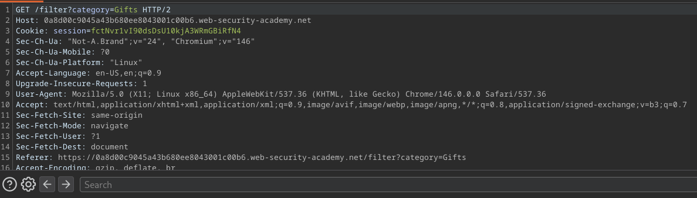 Now if we look at the request we notice that it queries the string `Gifts` to the database.

We can exploit this by changing `Gifts` to `'OR 1=1--`.
First apostrophy terminates the name check, evaluationg to an empty string. We append `OR 1=1` to the query, which is always true, allowing us to pull everything from database.
At last, `--` is a comment syntax, allowing to ignore `released =1` part of the query, as its being ignored by a comment.

### 2. SQL injection attack, querying the database type and version on Oracle (Practitioner)

To solve this lab, we must first find out the number of columns returned by a query, and than find out which columns contain text data.
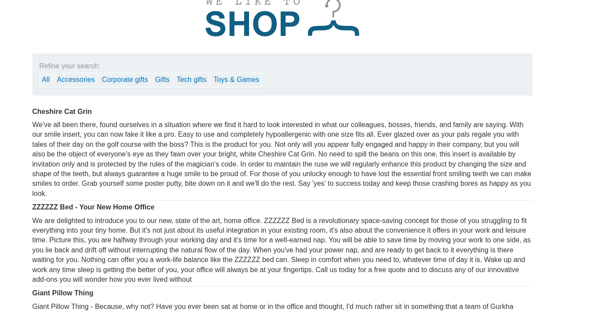
This is what we get when we enter the lab.

To find out the number of columns, we will perform a `UNION` attack. For a `UNION` query to work, query after `UNION` must match the number of columns returned, and every column must match the datatype of first queries column.

We will turn intercept on in BurpSuite.

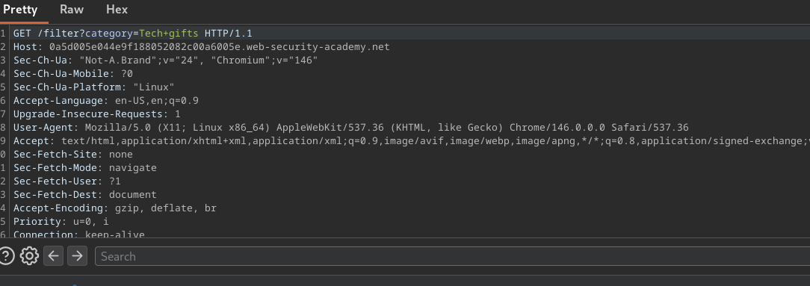

As before it queries the category name to the database. If its a not Oracle database we can modify the payload as `'UNION NULL--`, so we can see if it returns an error. But Oracle does require us to specify the table we are querying from. Oracle has a built in table called `dual`. Meaning payload will be `'UNION SELECT NULL from dual--` If it does return an error, that means query returns more than one column.

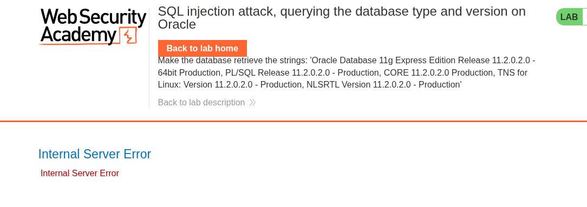

So lets try two columns now, meaning payload is `'UNION SELECT NULL,NULL from dual--`

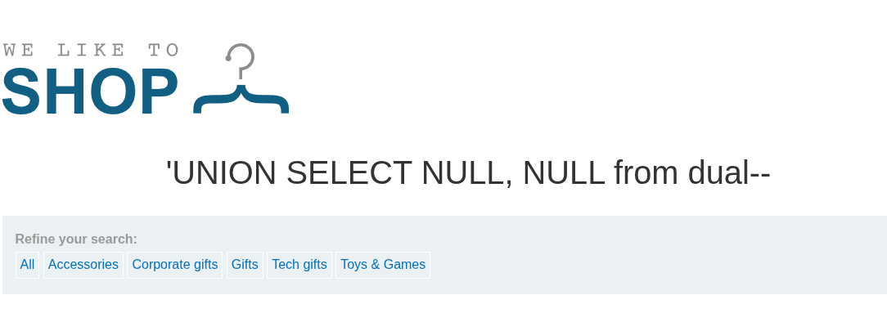

That worked, so let check which columns contain text. Lets just make the payload `'UNION SELECT 'a',NULL from dual`

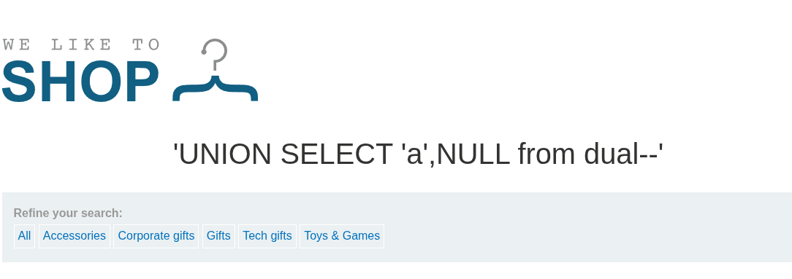 

That worked, so no we can query to version to pull oracle sensitive data.

To do this we will specify the payload as `'UNION SELECT BANNER, NULL FROM v$version--`

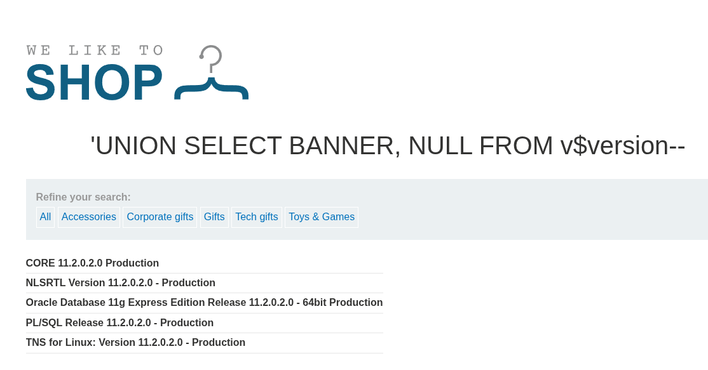

And we are seccessful.

### 3. SQL injection attack, querying the database type and version on MySQL and Microsoft

*This lab contains a SQL injection vulnerability in the product category filter. You can use a UNION attack to retrieve the results from an injected query.*

*To solve the lab, display the database version string.*

As in previous lab, we would turn interceptor on, then we need to determine number of columns, and their return types. Unlike Oracle, MySql and Microsoft do not require a table to be specified to perform `UNION`. Therefore we construct the payload as `'UNION SELECT NULL, NULL#` to determine number, and than `'UNION SELECT 'a', NULL#` to determine the string column.

At last we specify payload as `'UNION SELECT @@version, NULL#`

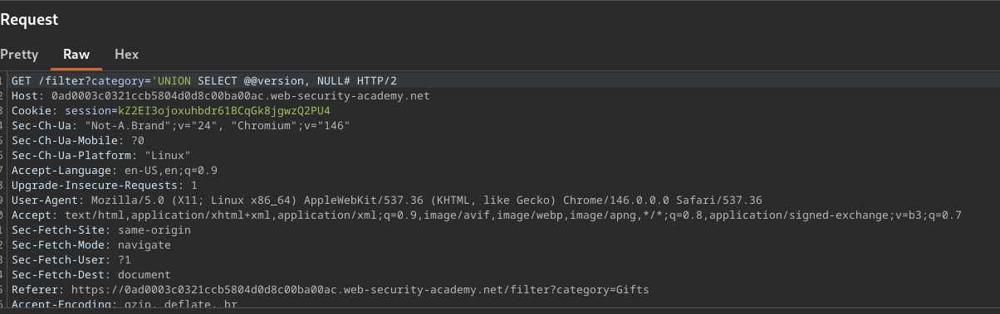

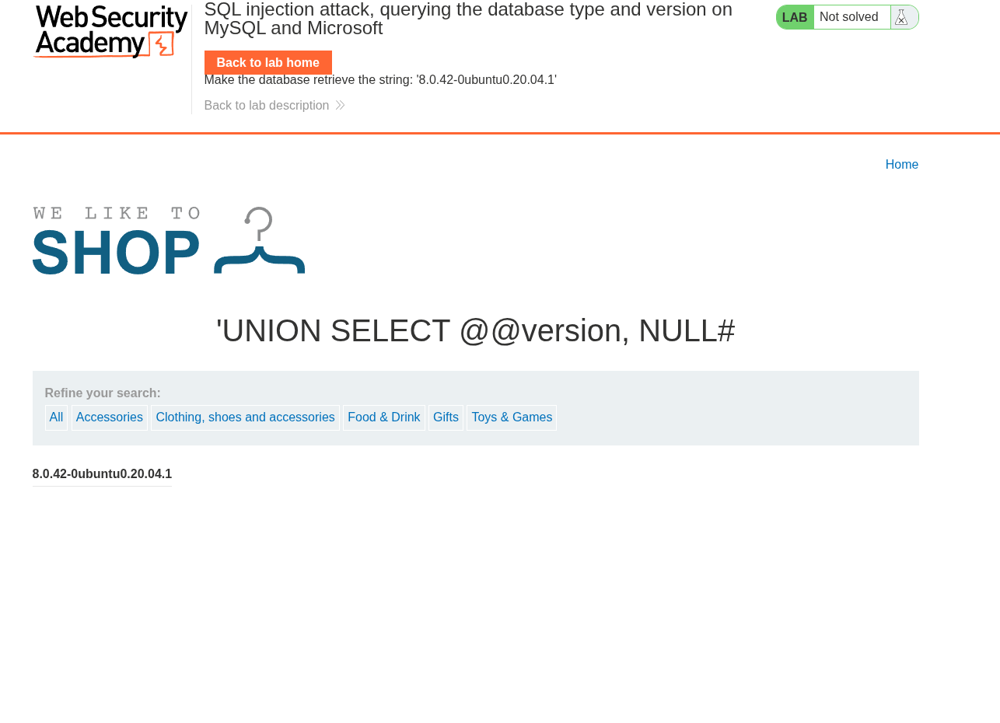

### 4. SQL injection attack, listing the database contents on Oracle

*This lab contains a SQL injection vulnerability in the product category filter. The results from the query are returned in the application's response so you can use a UNION attack to retrieve data from other tables.*

*The application has a login function, and the database contains a table that holds usernames and passwords. You need to determine the name of this table and the columns it contains, then retrieve the contents of the table to obtain the username and password of all users.*

Again intercept on.

We will repeat steps of finding out how many columns the query returns, and what type those columns are as in previous task.

Next we will try to list all tables in the database. Oracle has all_tables table containing table names. Therefore, we construct the payload as `'UNION SELECT TABLE_NAME,NULL FROM ALL_TABLES--`

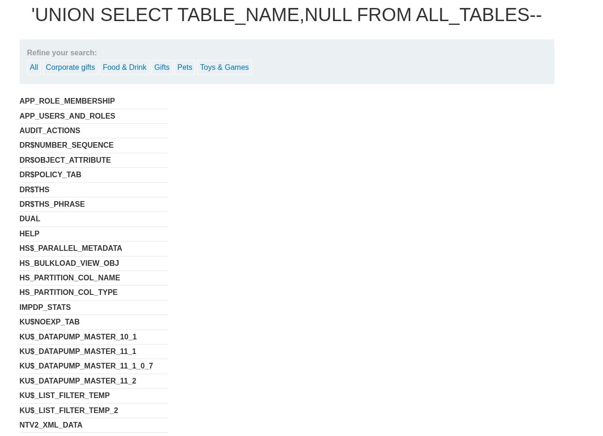

Now we have alist of tables, and thru searching it, we see a table named `USERS_EMIHHS` (or something like that, since lab enviroments are user specific). Now we can query to other tables, but first we must determine column names in the that table. To do this, we can use all_tab_columns to see what table columns are contained. So payload is `'UNION SELECT COLUMN_NAME,NULL FROM ALL_TAB_COLUMNS WHERE TABLE_NAME='USERS_EMIHHS'--`

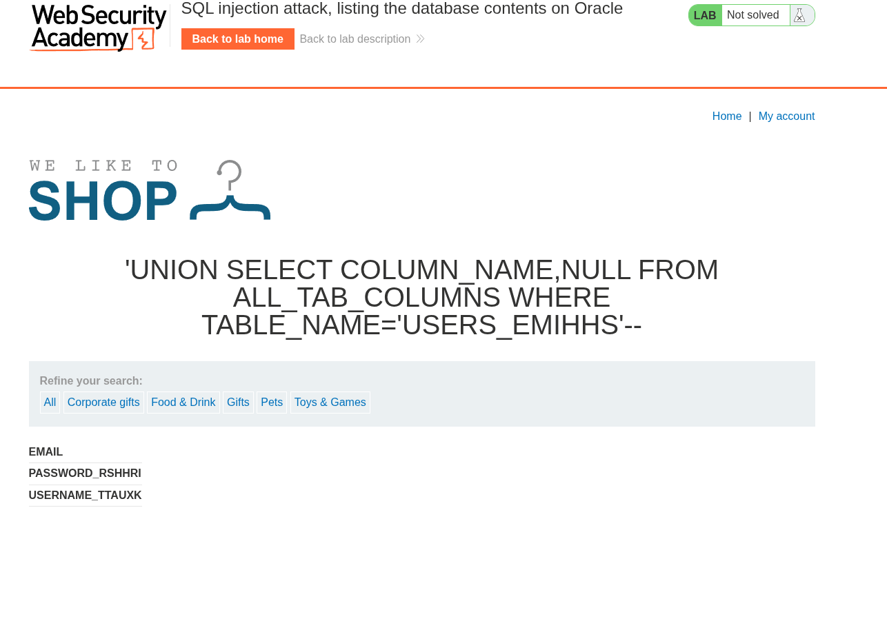

So now we can see username and password columns, so lets list users and their passwords. We consturct the payload as `'UNION SELECT 'un: ' || USERNAME_TTAUXK || '=== pw:' || PASSWORD_RSHHRI, NULL from USERS_EMIHHS--`

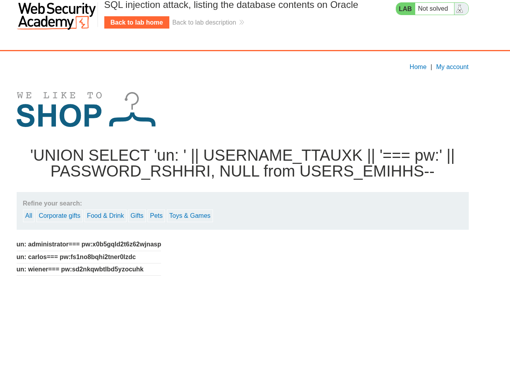 So lets try to log in as administrator

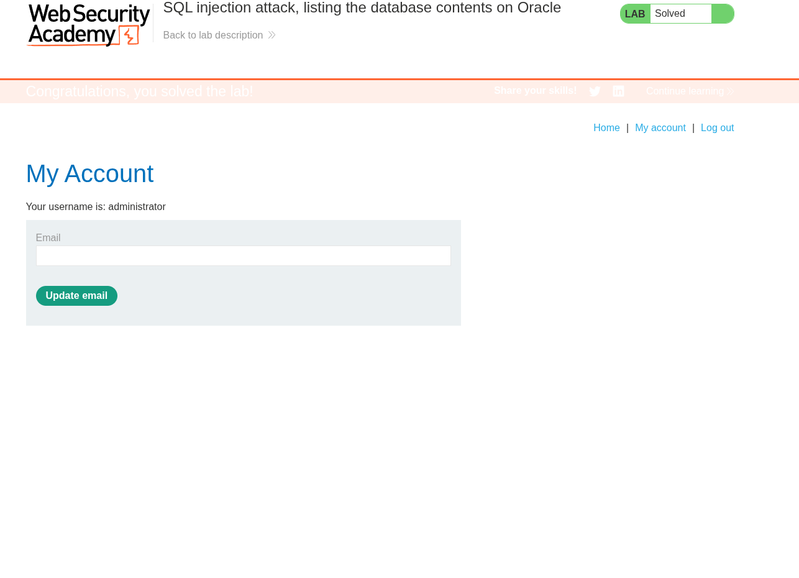 Victory, altough this would not work if passwords are hashed on server side.

### 5. Blind SQL injection with conditional responses

*This lab contains a blind SQL injection vulnerability. The application uses a tracking cookie for analytics, and performs a SQL query containing the value of the submitted cookie.*

*The results of the SQL query are not returned, and no error messages are displayed. But the application includes a Welcome back message in the page if the query returns any rows.*

*The database contains a different table called users, with columns called username and password. You need to exploit the blind SQL injection vulnerability to find out the password of the administrator user.*

*To solve the lab, log in as the administrator user.*

For Blind SQL attacks, we do not have a clear report that something went wrong. In a case of this lab, if a query fails, we are not presented an error. But it does say "Welcome back" if query is successful.

If we intercept a request, we can see the tracking cookie.

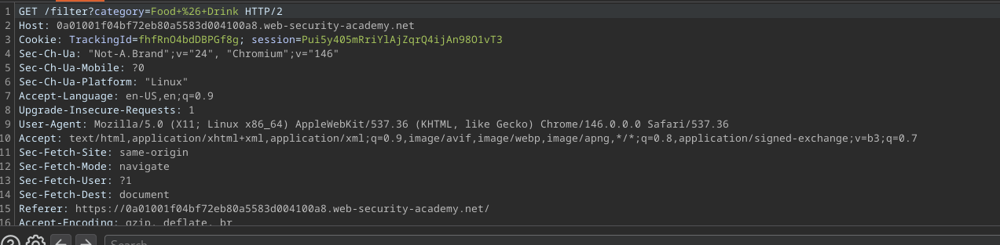

We could attempt to perform an injection on it. Lets first observe the behaviour of a the app, if we modify the payload to

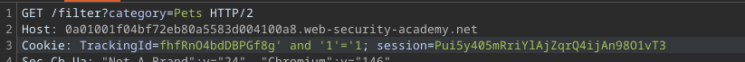

Then we do get a "Welcome back" message.

But if we modify the payload to 

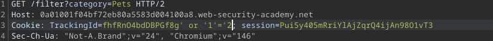 (`AND` here instead of `OR`, my fault)

Then we can see that "Welcome back" dissapeared.

If we assume there is a table `users`, we can construct a payload to check for it. In this case, we add `' and (select 'exists' from users limit 1)='exists`. Welcome message now appears. Therefore we can check if there is a user called `administrator`. With payload:

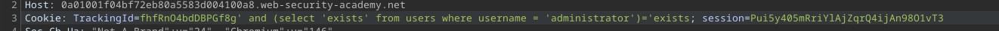

Then welcome back message is still present.

Good so far. Next step is to check for a password. We can construct payloads as `TrackingId=something' and (select 'e' from users where username='administrator' and length(password)>1)='e`, then iteratively move till we find out what is the password length. I will save you the hustle, lenght is 20. This is easily done by first intercepting a request, sending it to Burp Repeater, and then changeing the value.

After we have the length, we can move to Intruder.
We will intercept a request, and send it to intruder, then construct the payload as follows.

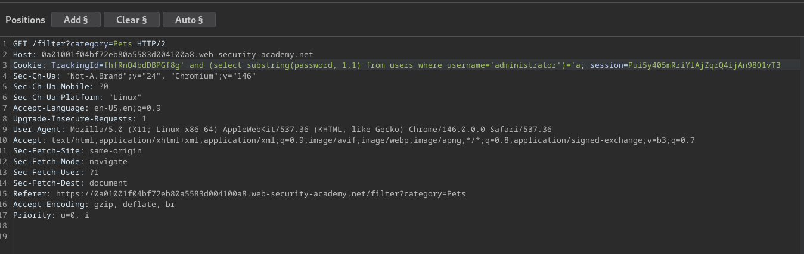

The substring function takes parameters:
- the string its performing operation on
- begin index
- stride

So in each round we will change the begin index to move thru the password.

We can highlight the ending `a`, the click the `Add` button. Moving to payloads we can declare payloads that the `a` will change to in rounds, in ranges of a-z and 0-9.

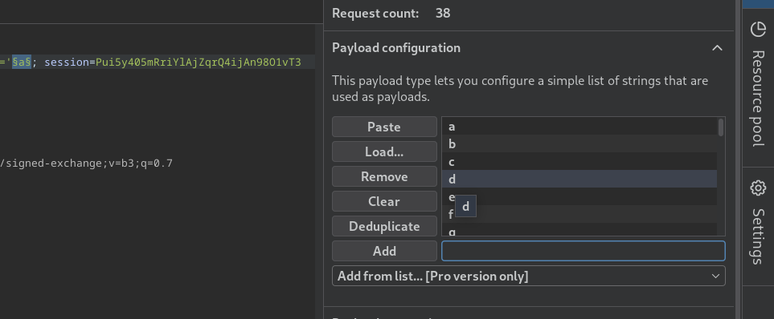

We can begin by pressing `Start Attack`, and then in Setting-> Grep Match, clear all entries and just add `Welcome back`, so we can check which character got us the response.
We repeat this 20 times getting all the password characters. in my case password was `ga2nxadp2aa1jha2p21z`

Now we move to login, and we an log into the app like an `administrator`.

## Prevention messures

Preventing SQL Injection (SQLi) is about separating the command from the data. If we are to treat user input as a literal part of the SQL command, the database can’t tell where code ends and a attacker's instructions begin.

### Prepared statements

This is the most effective way to prevent SQLi. Instead of building a query string with variables, we use placeholders (usually ? or :name).

The database compiles the query structure first, then places the user data later. Even if a user enters 1 OR 1=1, the database treats that entire string as a literal value to search for, not a command to execute.
### Stored Procedures

Stored procedures can be just as safe as prepared statements, provided they are written correctly. They keep the SQL logic on the database server itself.
Catch is that we still use parameters within the stored procedure. If the procedure simply concatenates strings internally to build a dynamic query, vulnerability persists.

### Principle of Least Privilege

Even if an attacker is able to inject a command, we can limit the damage done by contraining the database access and accounts.

-   We do not give sa or root, we create a specific user for the application
- We restrict permissions, only app users being able to use specific statements on specific tables.
- We restrict the ability to drop tables, access schemas or execute shell commands.

### Sanitization
We can perform manual cleaning of a string, to it escape by adding backslashes. Altough it is error prone, we can isntead use ORMs (Object Relational Mapper) like Hibernate, Entity Framework, Eloquent, etc.