# XSS - Cross-site Scripting

## Introduction

Cross-site scripting (also known as XSS) is a web security vulnerability that allows an attacker to compromise the interactions that users have with a vulnerable application. It allows an attacker to circumvent the same origin policy, which is designed to segregate different websites from each other. Cross-site scripting vulnerabilities normally allow an attacker to masquerade as a victim user, to carry out any actions that the user is able to perform, and to access any of the user's data. If the victim user has privileged access within the application, then the attacker might be able to gain full control over all of the application's functionality and data.

Cross-site scripting works by manipulating a vulnerable web site so that it returns malicious JavaScript to users. When the malicious code executes inside a victim's browser, the attacker can fully compromise their interaction with the application.

We can confirm most kinds of XSS vulnerability by injecting a payload that causes the browser to execute some arbitrary JavaScript.

There are three main types of XSS attacks. These are:

- Reflected XSS, where the malicious script comes from the current HTTP request. An application receives data in an HTTP request and includes that data within the immediate response in an unsafe way.

- Stored XSS, where the malicious script comes from the website's database. An application receives data from an untrusted source and includes that data within its later HTTP responses in an unsafe way.
The data in question might be submitted to the application via HTTP requests; for example, comments on a blog post, user nicknames in a chat room, etc.

- DOM-based XSS, where the vulnerability exists in client-side code rather than server-side code. An application contains some client-side JavaScript that processes data from an untrusted source in an unsafe way, usually by writing the data back to the DOM.

## Detection  of vulnerability
Manually testing for reflected and stored XSS normally involves submitting some simple unique input (such as a short alphanumeric string) into every entry point in the application, identifying every location where the submitted input is returned in HTTP responses, and testing each location individually to determine whether suitably crafted input can be used to execute arbitrary JavaScript.

Manually testing for DOM-based XSS arising from URL parameters involves a similar process: placing some simple unique input in the parameter, using the browser's developer tools to search the DOM for this input, and testing each location to determine whether it is exploitable. However, other types of DOM XSS are harder to detect.

## Burp tasks

### 1. Stored XSS into HTML context with nothing encoded (Apprentice)

*This lab contains a stored cross-site scripting vulnerability in the comment functionality.*

*To solve this lab, submit a comment that calls the alert function when the blog post is viewed.*

When we enter a lab we are presented with a "blog" and we have listed posts.

If we click "View post", we can get more details on a specific post.

As well as the comment section with a section for use to leave a comment.

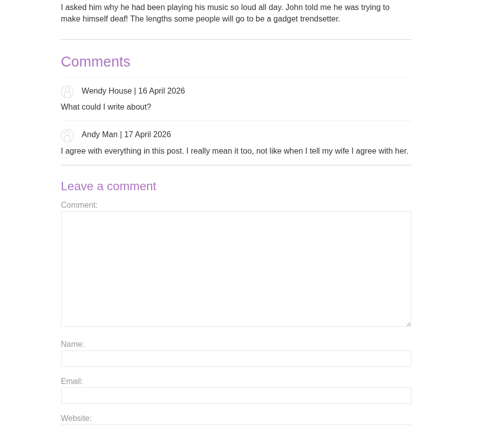

To execute the attack we will write `<sript>alert("anything")</script>` as the comment text.

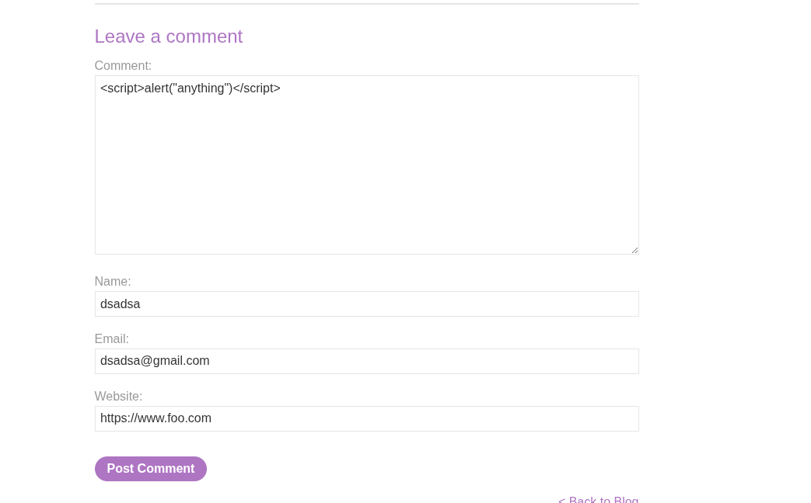

We post a comment, and next time we load that post we get:

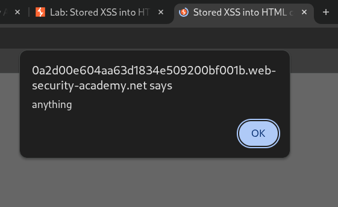

### 2. DOM XSS in innerHTML sink using source location.search(Practitioner)

*This lab contains a DOM-based cross-site scripting vulnerability in the search blog functionality. It uses an innerHTML assignment, which changes the HTML contents of a div element, using data from location.search.*

*To solve this lab, perform a cross-site scripting attack that calls the alert function.*

When we enter the lab we get a screen as follows.

If we type any string, and search it, by looking at the F12 menu and DOM, we can see that it appends the searched value to the elements, as childlren of a ``.

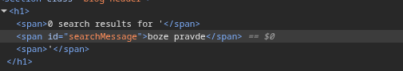

If we write a `` as a search term, it is also represented in the DOM.

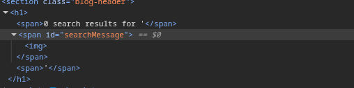

To run any form of JavaScript, we can use a `onerror` function, provided in img tag. So our payload for search term is ``

And if we hit `Search`, we get:

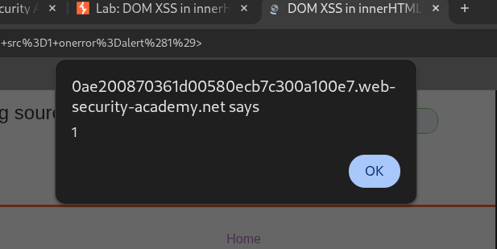

### 3. DOM XSS in AngularJS expression with angle brackets and double quotes HTML-encoded (Practitioner)

*This lab contains a DOM-based cross-site scripting vulnerability in a AngularJS expression within the search functionality.*

*AngularJS is a popular JavaScript library, which scans the contents of HTML nodes containing the ng-app attribute (also known as an AngularJS directive). When a directive is added to the HTML code, you can execute JavaScript expressions within double curly braces. This technique is useful when angle brackets are being encoded.*

*To solve this lab, perform a cross-site scripting attack that executes an AngularJS expression and calls the alert function.*

We are presented a search box, and if we do search any string, we can notice that it appears in `ng-app`, meaning its a part of Angular Template. This means that Angular brackets, or `{{ expression }}` will evaluate as an expression.

Therefore, if we write something like `{{ $on.constructor('alert(1)')()}}`, it will be treated as a dynamic template, which will evalute the expression. So if we type that payload, we get:

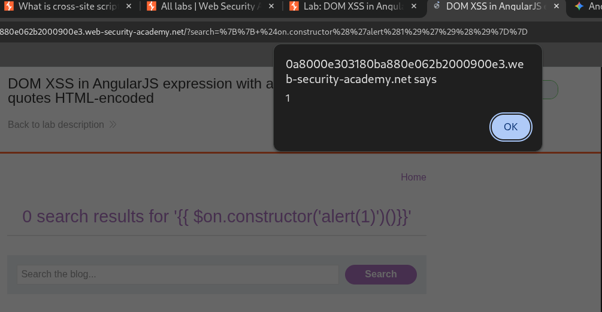

### 4. Stored DOM XSS (Practitioner)

*This lab demonstrates a stored DOM vulnerability in the blog comment functionality. To solve this lab, exploit this vulnerability to call the alert() function.*

Lab is once again, a blog forum. So lets try again to do `` in comment text input.

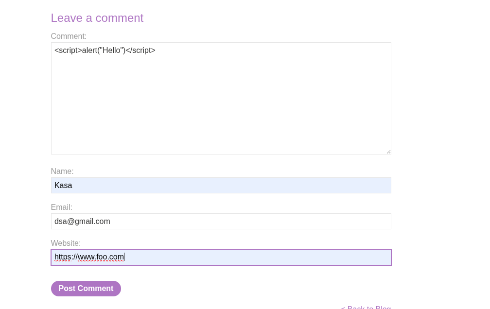

We post a comment, but when we come back to the post, our JS doesnt execute, and the comment we posted is as follows:

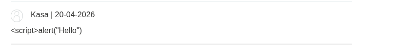

So payload as a `` did not work, so lets assume we cannot use enclosing tags. So lets instead use an ``. Let the payload be ``.

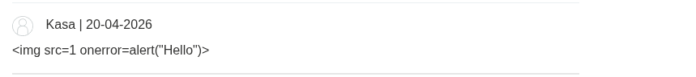

So that didnt work, but if we look at F12, we can see this.

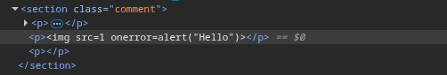

So anything that is a comment text, evalutes to a text of the `
` tag. So we somehow need to terminate the tag prematurely, so our payload gets embedded as an ``. So we can construct a payload as `

`. If we submit that as our comment, at last, we get:

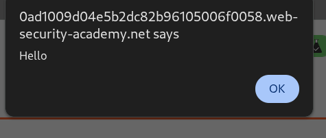

### 5. Stored XSS into onclick event with angle brackets and double quotes HTML-encoded and single quotes and backslash escaped

*This lab contains a stored cross-site scripting vulnerability in the comment functionality.*

*To solve this lab, submit a comment that calls the alert function when the comment author name is clicked.*

Using Interceptor and Burp Repeater, if we send a post comment request we can see that encodes our webiste as:

And now if we load the post, and send that request to Repeater, we can notice that our webisite is being sent to onclick event handler attribute of a comment.

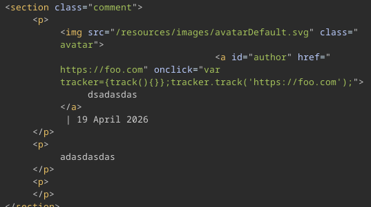

So it is represented as a string, so we can try and escape it and manipulate JS to force this to be an expression. To do this, lets take a look what happens when we write `'a'-funcionCall*'b'`. This will not contatenate but instead it would be an expression (Arithemtic Coercion), and JS would resolve the `functionCall`. So to do this, we can construct payload as `https://www.any?&apos;-alert("Hello")-&apos;`. We would use any arithemtic operator except `+`, since we would not want to accidentally concatenate strings, rather to force JS to evaluate them as mathematical operation. If we now click on the comment author's name, it sends us to the website we have provided, we get:

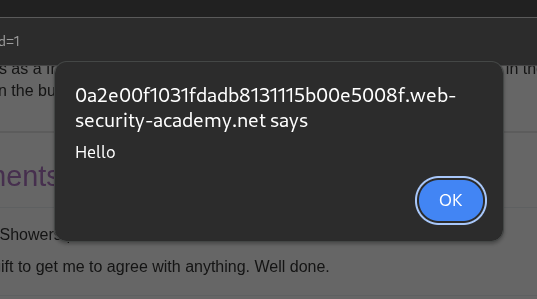

## Prevention messures

Preventing cross-site scripting is trivial in some cases but can be much harder depending on the complexity of the application and the ways it handles user-controllable data.

Preventing XSS vulnerabilities is likely to involve a combination of the following measures:

- Filter input on arrival. At the point where user input is received, filter as strictly as possible based on what is expected or valid input.

- Encode data on output. At the point where user-controllable data is output in HTTP responses, encode the output to prevent it from being interpreted as active content. Depending on the output context, this might require applying combinations of HTML, URL, JavaScript, and CSS encoding.

- Use appropriate response headers. To prevent XSS in HTTP responses that aren't intended to contain any HTML or JavaScript, you can use the Content-Type and X-Content-Type-Options headers to ensure that browsers interpret the responses in the way you intend.

- Content Security Policy. As a last line of defense, you can use Content Security Policy (CSP) to reduce the severity of any XSS vulnerabilities that still occur.