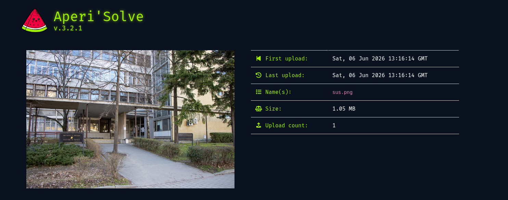
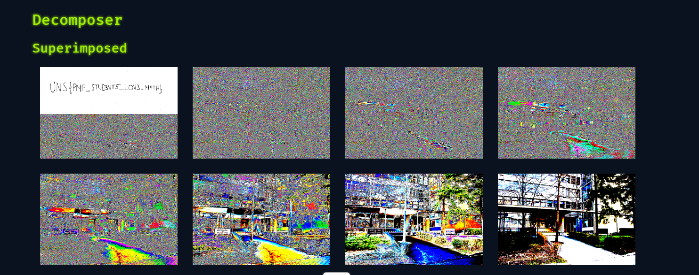
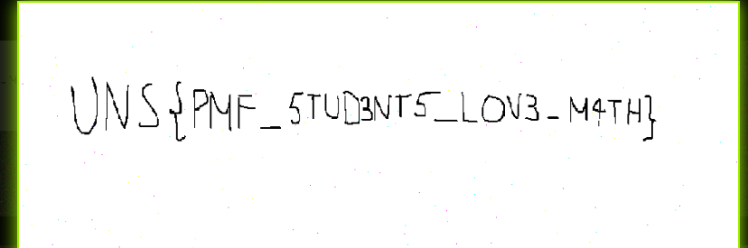

# Pixel Perfect

## Challenge

```txt
6. Pixel Perfect
	- Flag format : UNS{}
	- Your college mate likes to take photos in his spare time. He recently sent you a picture of him and said he had something very important to tell you. Since then, there is no trace of him. Maybe you should take a closer look at the picture?
```

## Approach

The challenge provides us with a picture, and we are asked to take a closer look at it. The first thing that comes to mind is to check the metadata of the image, as it might contain some hidden information.

The first idea that got in my head was to use some staganography tools to check if there is any hidden message in the image. I used online tool mentioned on the class last week called `Aperi'Solve` to check for any hidden messages and it worked. The image wasn't password protected.

As mentioned in the task message it flag format is `UNS{}` so I looked for any text that might be hidden in the image.







I found a hidden message that says `UNS{PMF_5TUD3NT5_LOV3_M4TH}`. This is the flag for the challenge.

The other thing I tried was to use the steghide command tool but it doesn't support png files.

```bash
steghide extract -sf sus.png
Enter passphrase:
steghide: the file format of the file "sus.png" is not supported.
```
