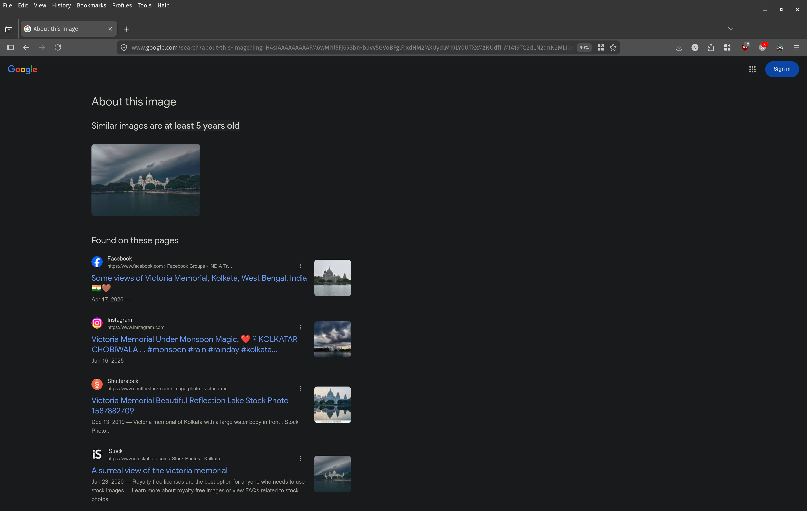
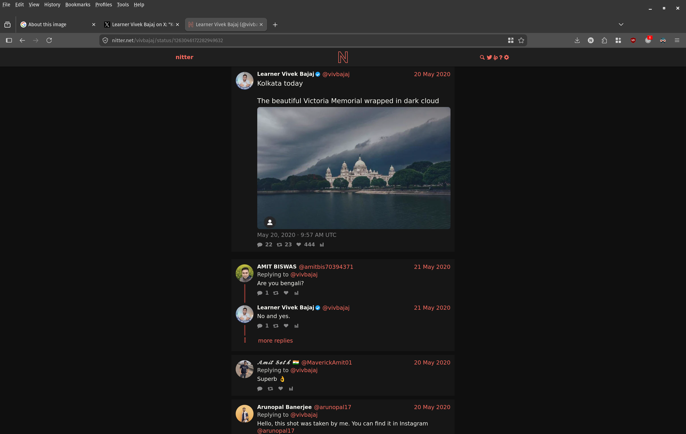
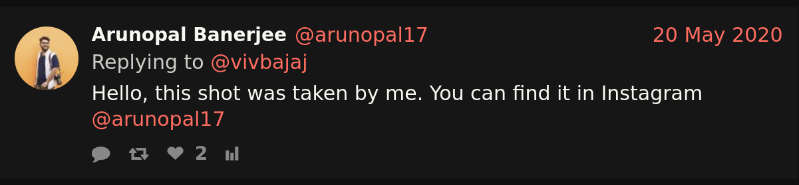
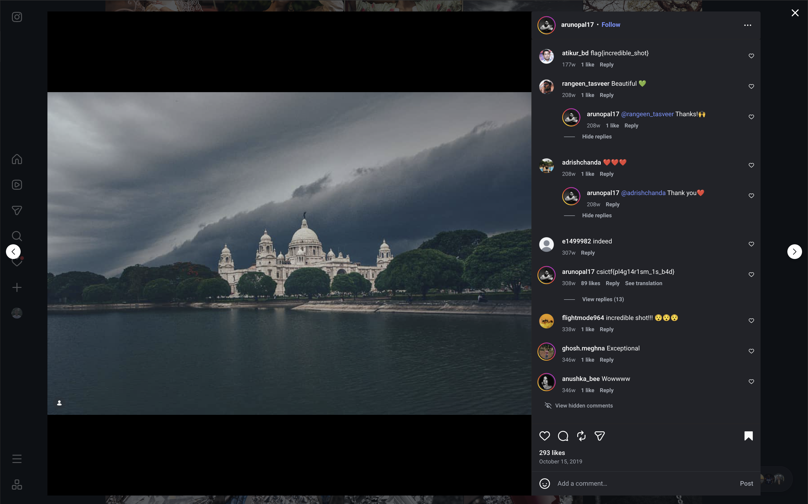

# Pirates of Memorial

## Challenge

```txt
2. PIRATES OF MEMORIAL
	- Flag format : csictf{}
	- The original photographer of this picture commented the flag on his post. Find the flag.
```

## Approach

The challenge gives us a picture of the Victoria Memorial in Kolkata and asks us to find the original photographer, who supposedly left the flag in a comment on their post.

I started with a reverse image search on Google to find where else this picture appears online and who might be the original author.



Among the results was a tweet from a user called `Learner Vivek Bajaj` (`@vivbajaj`), posted back in May 2020, captioned "Kolkata today - The beautiful Victoria Memorial wrapped in dark cloud".


This tweet wasn't the original source either, since in the replies another user, `Arunopal Banerjee` (`@arunopal17`), pointed out that the photo was actually his and that it could be found on his Instagram.





I searched for the Instagram handle `@arunopal17` and found his profile, a photographer who posts a lot of artistic and product photography.


I scrolled through his older posts until I found the original photo of the Victoria Memorial, dated back to 2019. Looking through the comments on that post, I found the flag left by the photographer himself: `csictf{pl4g14r1sm_1s_b4d}`.



This is the flag for the challenge:

```
csictf{pl4g14r1sm_1s_b4d}
```
