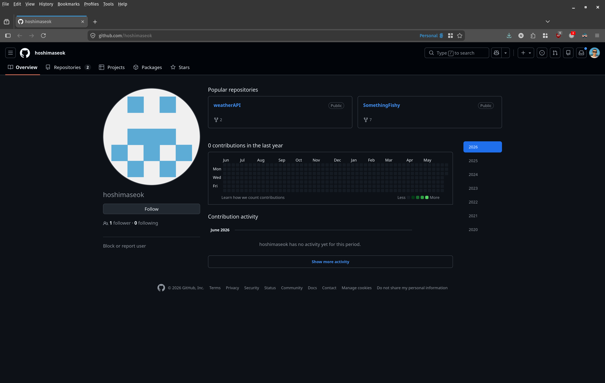
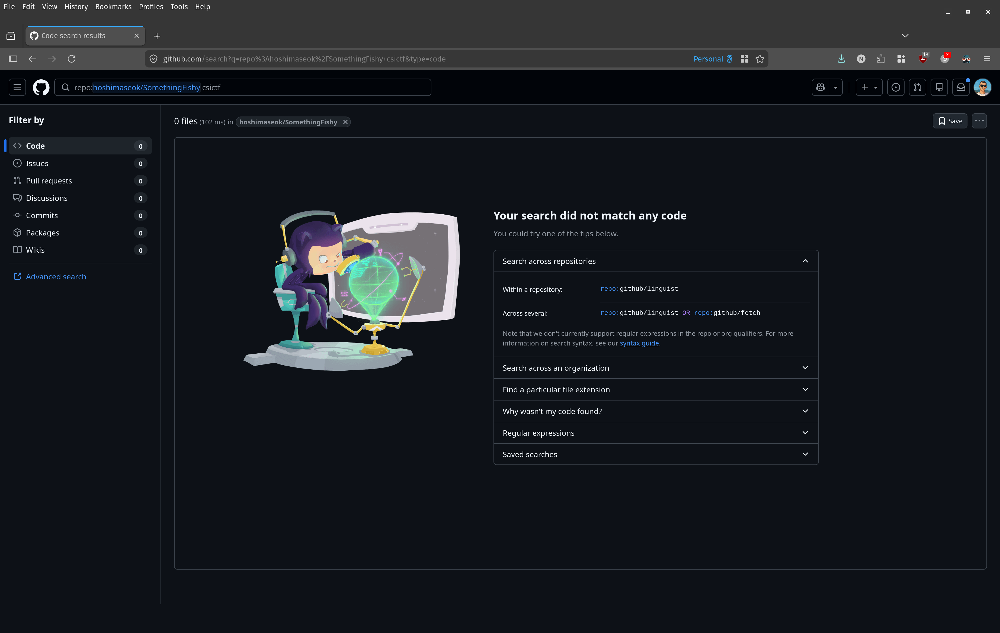
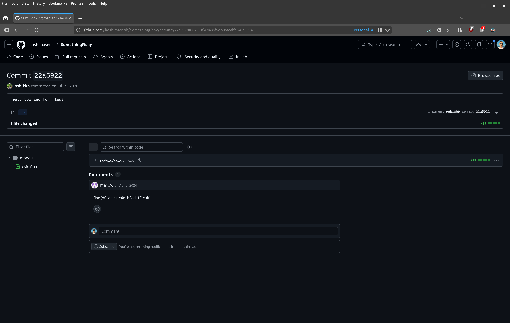

# Commitment

## Challenge

```txt
3. COMMITMENT
	- Flag format : csictf{}
	- hoshimaseok is up to no good. Track him down.
```

## Approach

Googling the username `hoshimaseok` immediately surfaces their GitHub profile. The account has two public repositories: `weatherAPI` and `SomethingFishy` — the second one is the obvious lead.



A code search for `csictf` inside the `SomethingFishy` repository returns no results, so the flag isn't sitting in any file in the current state of the repo.



Browsing the commit history reveals a commit with the message **"feat: Looking for flag?"**. Opening it shows that a file `models/csictf.txt` was added. More importantly, a comment left on the commit contains the flag: `csictf{d0_osint_c4n_b3_d1ff1cult}`.



This is the flag for the challenge:

```
csictf{d0_osint_c4n_b3_d1ff1cult}
```
