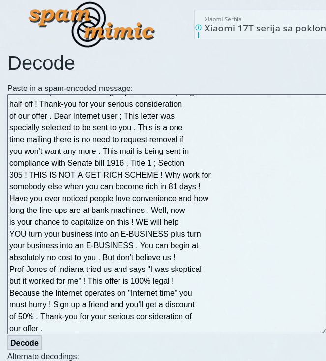
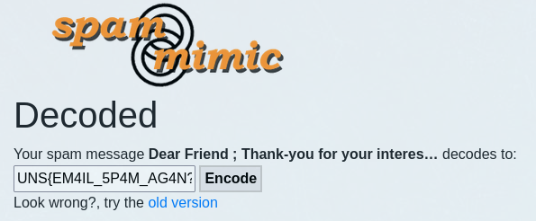

# Nigerian Prince

## Challenge

With the challenge come to `txt` files:
- **email.txt** reading:
    ```txt
    Dear Friend ; Thank-you for your interest in our newsletter 
    ! If you no longer wish to receive our publications 
    simply reply with a Subject: of "REMOVE" and you will 
    immediately be removed from our mailing list . This 
    mail is being sent in compliance with Senate bill 1622 
    , Title 8 ; Section 308 . THIS IS NOT MULTI-LEVEL MARKETING 
    ! Why work for somebody else when you can become rich 
    in 23 WEEKS . Have you ever noticed most everyone has 
    a cellphone and more people than ever are surfing the 
    web ! Well, now is your chance to capitalize on this 
    ! We will help you turn your business into an E-BUSINESS 
    & increase customer response by 140% ! You are guaranteed 
    to succeed because we take all the risk ! But don't 
    believe us ! Mrs Jones who resides in Connecticut tried 
    us and says "My only problem now is where to park all 
    my cars" ! We are a BBB member in good standing . We 
    BESEECH you - act now . Sign up a friend and you get 
    half off ! Thank-you for your serious consideration 
    of our offer . Dear Internet user ; This letter was 
    specially selected to be sent to you . This is a one 
    time mailing there is no need to request removal if 
    you won't want any more . This mail is being sent in 
    compliance with Senate bill 1916 , Title 1 ; Section 
    305 ! THIS IS NOT A GET RICH SCHEME ! Why work for 
    somebody else when you can become rich in 81 days ! 
    Have you ever noticed people love convenience and how 
    long the line-ups are at bank machines . Well, now 
    is your chance to capitalize on this ! WE will help 
    YOU turn your business into an E-BUSINESS plus turn 
    your business into an E-BUSINESS . You can begin at 
    absolutely no cost to you . But don't believe us ! 
    Prof Jones of Indiana tried us and says "I was skeptical 
    but it worked for me" ! This offer is 100% legal ! 
    Because the Internet operates on "Internet time" you 
    must hurry ! Sign up a friend and you'll get a discount 
    of 50% . Thank-you for your serious consideration of 
    our offer . 
    ```
- task.txt reading:
    ```txt
    4. Nigerian Prince
	- Flag format : UNS{}
	- Your friend received a very strange email. Since he knows you understand computers, he sent you the email's content and asked you to check if that email has any meaning or it's just another spam?

    ```

## Approach

Email itself looks wierd, i was not sure if it was two seperate emails, or was it one and they made a mistake. Context of words is strange, like the writere just decided to drop everything from their mind into a single email. Also, spacing is wierd, same as punctuation. Who seperates words and interpunction signs like that? Not to mention that some phrases repeat, like "Thank you for your serious consideration of our offer .". 

Since it looked purposefully made this way, i decided to send it to some known cyphers. Base64, Ashtab and Ceaser returned nothing, so this must me something more advanced.

Thru some reasearch i learnt that you are able to hide messages inside the email thru spam words like these. So i visited the website called `spammimic.com` and pasted the email text.



Clicking decode, we get this:



We get our flag, reading ***UNS{EM4IL_5P4M_AG4N?}***.