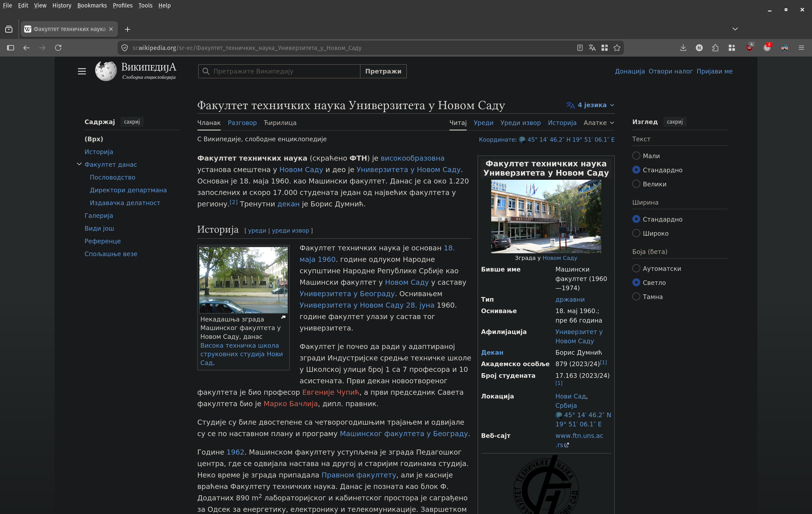
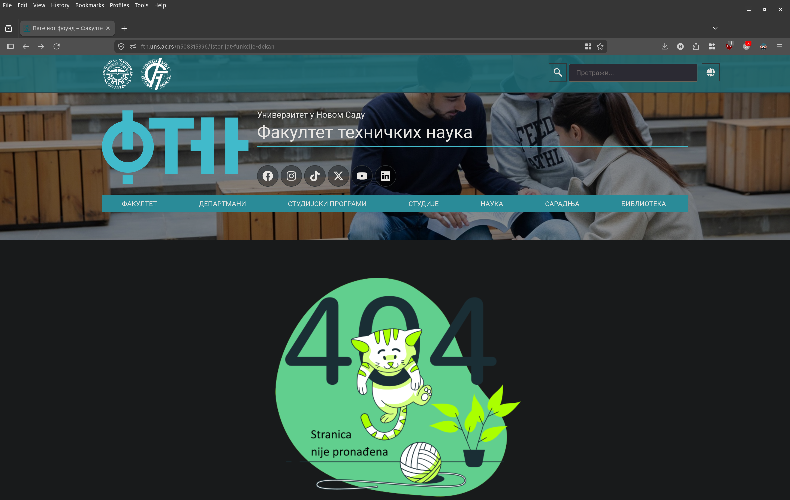
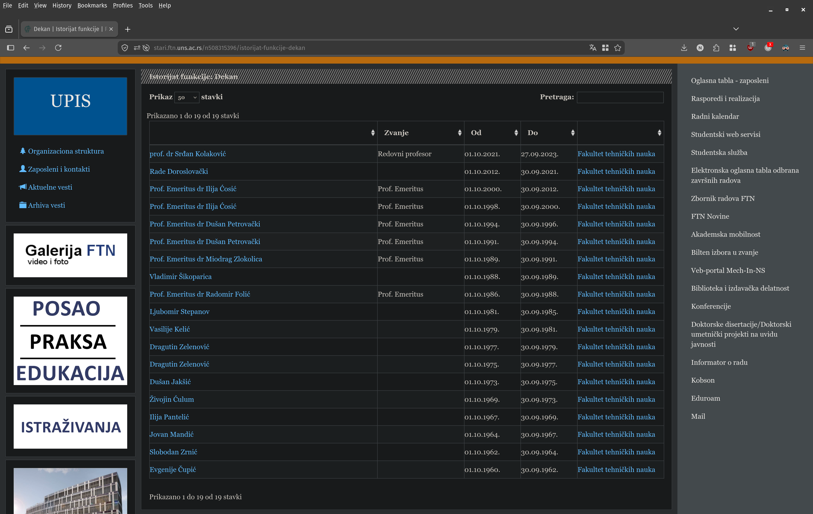
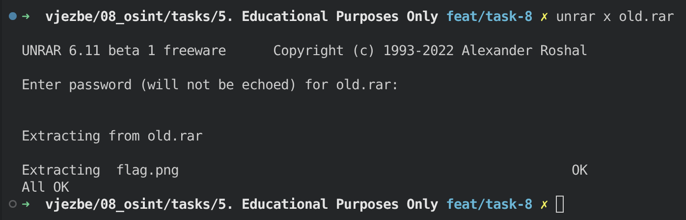

# Educational Purposes Only

## Challenge

```txt
5. Educational Purposes Only
	- Flag format : UNS{}
	- Together with your friends, you browsed the web archive of the Faculty of Technical Sciences and came across some very old archive. You downloaded it to see what was inside, but it was locked. Along with it, you also found a file that you think can help you unlock the archive.
```

We are given a password protected `old.rar` archive and a file called `forgotten_password.txt`. The latter explains how to "forge" the password: answer four questions about the history of the Faculty of Technical Sciences (FTN), check each answer against an MD5 hash using `md5hashgenerator.com`, and merge the correct answers together to get the password.

```txt
In order to forge the password, answer following questions and merge the answers together. Good luck!
https://www.md5hashgenerator.com/

1. Date when Faculty of Technical Sciences officialy opened. (Date Format : DD/MM/YYYY) MD5 : 02c3890bb0b03a24b99c3e4a39f18c44

2. First name of the person who held the position of dean at the faculty from 01.10.1975. until September 30, 1977. ? MD5 : 06904f68128802c069e782b772e85eda

3. The date when the FTN website was launched. (Date Format : DD/MM/YYYY) MD5 : f4d7caf81e33bc156cc3e98cf8095d2e

4. The year when studies in the field of "Poštanski saobraćaj i telekomunikacije" were introduced. MD5 : 5ec829debe54b19a5f78d9a65b900a39
```

## Approach

### Question 1 - founding date of FTN

The founding date of the faculty is public knowledge, so a quick search on Wikipedia gave the answer right away: `18/05/1960`. Hashing it confirmed the match with `02c3890bb0b03a24b99c3e4a39f18c44`.



### Question 2 - first name of the dean (01.10.1975 - 30.09.1977)

For the second question I needed the history of the dean function ("istorijat funkcije dekan"). Searching for it directly on the current FTN website (`ftn.uns.rs`) led to a 404 page, since the site has since been redesigned and the old page removed.



Luckily, the faculty kept its old website online at `stari.ftn.uns.rs`, and the page was still there. It contained a complete list of all the deans of the faculty along with the exact dates of their terms. The person who held the position from 01.10.1975 to 30.09.1977 was `Dragutin Zelenović`, so the answer to this question is his first name, `Dragutin`. This matched the given hash `06904f68128802c069e782b772e85eda`.



### Question 3 - launch date of the FTN website

This one couldn't simply be googled - there is no public record of the exact date the website went online. Since the answer had to be a date in `DD/MM/YYYY` format and we were given its MD5 hash (`f4d7caf81e33bc156cc3e98cf8095d2e`), I wrote a small script, `date_hash.py`, that brute forces every date in a chosen range, hashes it with MD5 and compares it against the target hash:

```python
import hashlib
from datetime import datetime, timedelta
from concurrent.futures import ProcessPoolExecutor, as_completed
from multiprocessing import cpu_count

def check_date(date_tuple):
    year, month, day = date_tuple
    date_str = f"{day:02d}/{month:02d}/{year}"
    md5_hash = hashlib.md5(date_str.encode()).hexdigest()
    return (date_str, md5_hash)

def find_date_parallel(target_hash):
    start_date = datetime(2000, 1, 1)
    end_date = datetime(2013, 12, 31)
    ...
```

Running it against the hash from question 3 over a range of plausible years for a faculty website (the faculty itself was founded in 1960, but websites only became common from the late 90s/early 2000s onward) found a match: `18/05/2005`.

### Question 4 - year "Poštanski saobraćaj i telekomunikacije" studies were introduced

The Department of Traffic Engineering (FTN Saobraćaj) has its own separate website at `saobracaj.ftn.uns.ac.rs`, which has a dedicated history ("istorijat") section with a timeline of important milestones for the department, including the introduction of the "Poštanski saobraćaj i telekomunikacije" study program. There I found the year `1999`, which matched the given hash `5ec829debe54b19a5f78d9a65b900a39`.


### Putting it all together

Merging the four answers together, in the order the questions were asked, gives the password to the archive:

```
18/05/1960Dragutin18/05/20051999
```

Using this password to extract `old.rar` worked and revealed a single file, `flag.png`.



Opening `flag.png` revealed the flag, handwritten on a plain white background: `UNS{V3RY_OLD_4RCH1V3}`.

This is the flag for the challenge:

```
UNS{V3RY_OLD_4RCH1V3}
```
