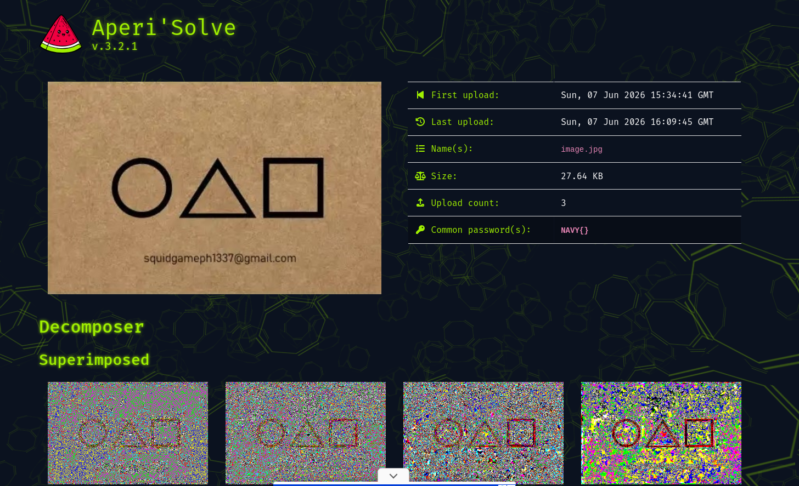
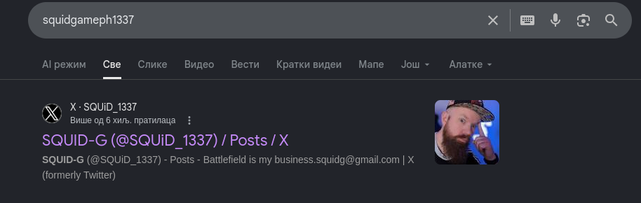
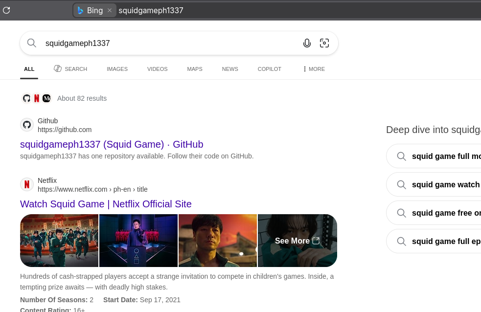
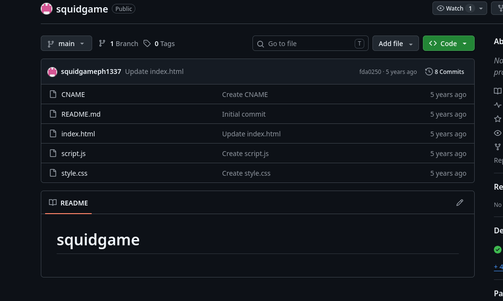
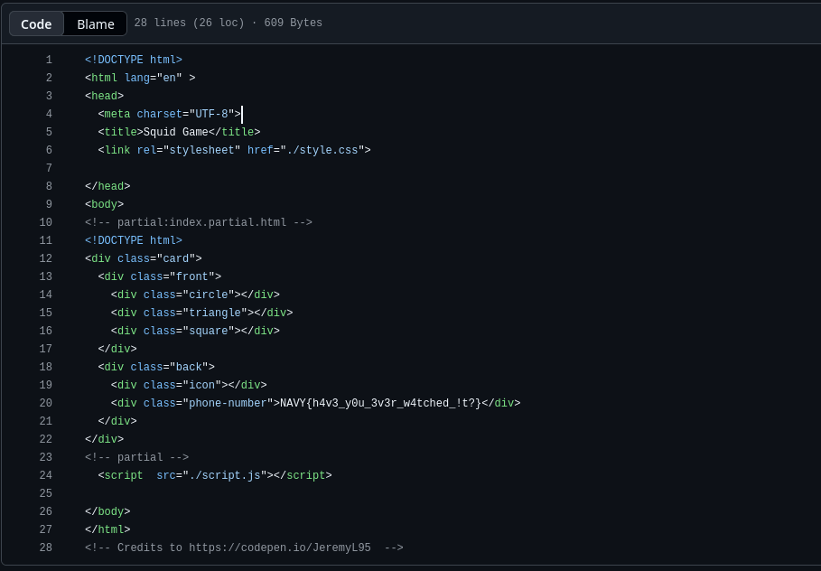

# SquidGame


## Challenge

We are provided with 2 items:
- a `txt` file reading:

    ```txt
    8. Squid Game Invitation
        - Flag format : NAVY{}
    ```

    Assume that we look for a flag that is wrapped in `NAVY{}`.
- And an image:

    

    Classical Squidgame characters as seen in the TV series.


## Approach

Since challenge provided us with an image, I wasted no time and went to `https://www.aperisolve.com` to check if image hides something.



But thru searching images, decoded signatures and properies, I have not found anything that remotely resalbes the `NAVY{}` flag. Therefore I have decided to checkout the email provided on the image, `squidgame1337@gmail.com`. Searching the email itself revealed nothing, but we can assume that someone had named themselves `squidgame1337`.

A google search yielded the following results:



Yeah that doesnt seem like anything serious.Besides that, I checkouted out some posts, and I did not find anything resembling the flag. Looks like its genuinely some guy's X account.

I switched to Bing to search:



So now we get some footing, we have a github account. Checking out this user's github account, he has only one repository caled `Squid Game`.
The project structure is as follows:



Checking out the files, I thought that I found some information in `style.css` file, since it references an image. But that image is just the cardboard background that we've seen on the picture that came with the challenge.

But looking at `index.html`:



Bingo, flag is in the `div` with class `phone-number`, reading ***NAVY{h4v3_y0u_3v3r_w4tched_!t?}***.