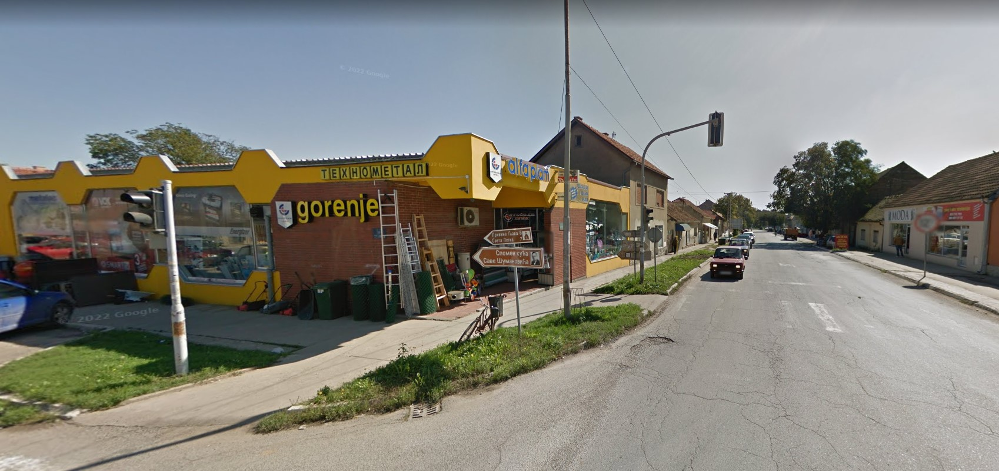
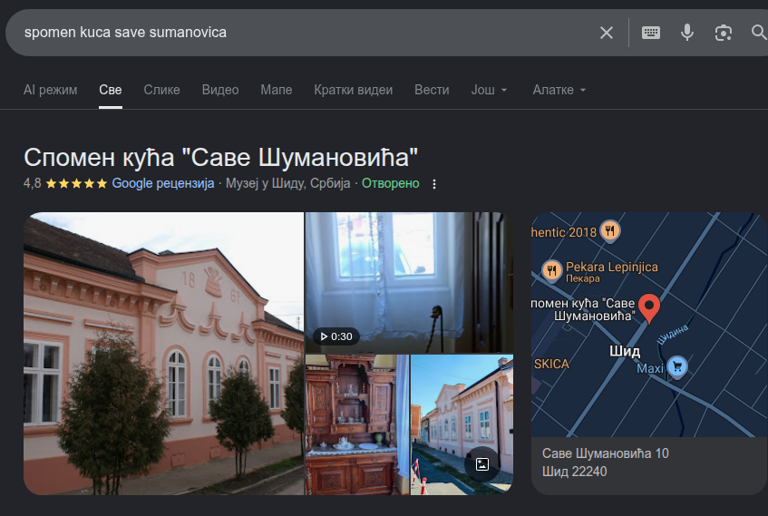
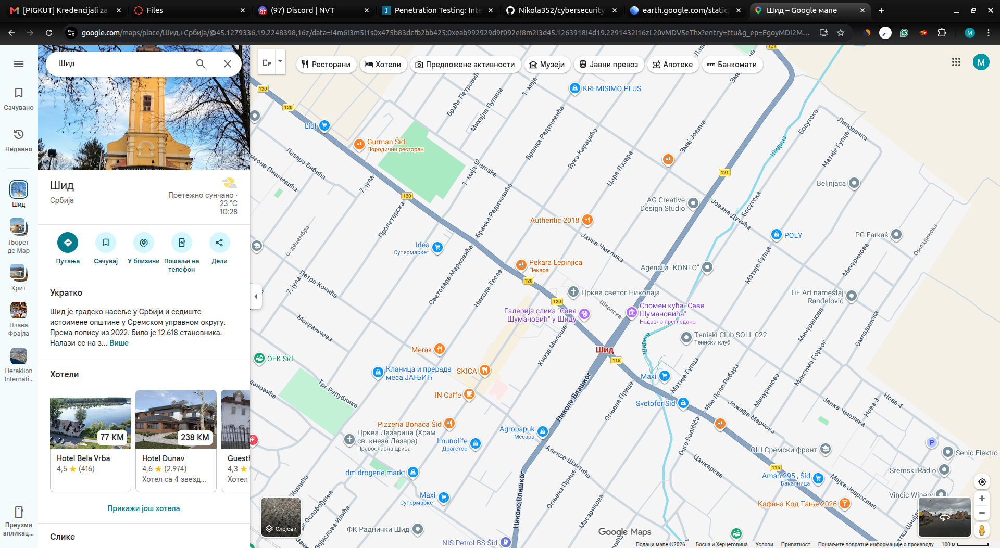
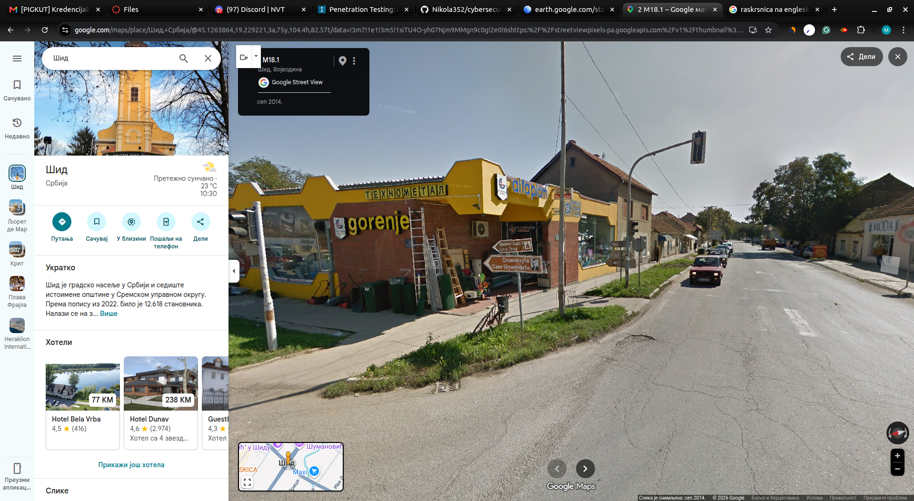
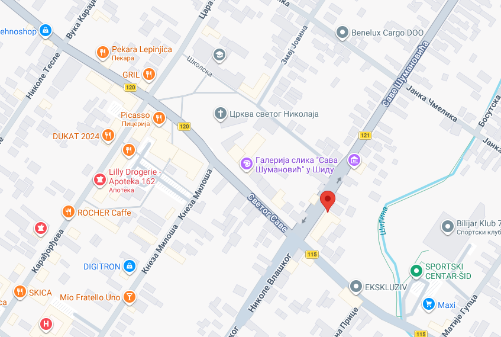

# 9. Maps OSINT 1

## Challenge

Get location of the place in the image.

```txt
Flag Format : UNS{XX.XXXXXXX,XX.XXXXXXX}
```



## Approach

The first thing I noticed is the sign with the text on it: "Spomen kuca Save Sumanovica". I knew that Savo Sumanovic was famous painter and that he lived in Sid city. So I searched for "Spomen kuca Save Sumanovica" on Google and I found the location of the place in the image. The coordinates are `45.130833, 19.652222`.

I googled the term and I was right it was Sid.



Also one more thing i noticed is `Gorenje` logo on building. I searched for "Gorenje Sid" and I found that there is a Gorenje store in Sid city.

I didn't get any response from that search meaning it is closed.

Went to google maps and searched for Sid city and I saw this crossroad with the same buildings as in the image. I zoomed in and I found the exact location of the place in the image.



Changed on street view and found the exact image from the challenge.





Final answer:`UNS{45.12687433320259, 19.229782097603227}`
